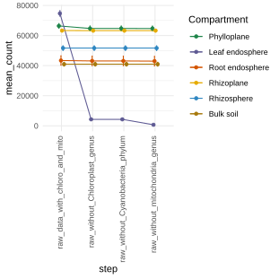
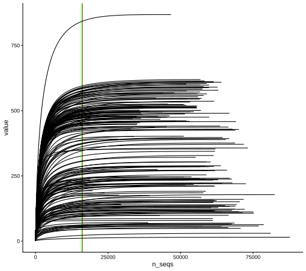
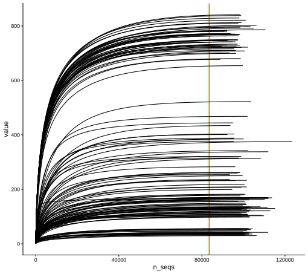

## Data importation & rarefaction

```{r}
# Pkg install -----
packages <- c(
  "ggpubr", "rstatix", "broom", "ggplot2", "multcompView", "ggrepel", "ggpattern",
  "readxl", "tidyverse", "dplyr", "knitr", "kableExtra", "FactoMineR", "vegan",
  "phyloseq", "sjPlot", "pscl", "patchwork", "ggtext", "RColorBrewer",
  "zCompositions", "lme4", "emmeans", "metacoder", "foreach", "doParallel",
  "forcats", "scales", "colorspace", "gplots", "statmod", "ComplexUpset",
  "paletteer"
)

install.packages(setdiff(packages, installed.packages()[,"Package"]))

if (!requireNamespace("devtools", quietly = TRUE)) install.packages("devtools")

# qiime2R et metacoder depuis GitHub
devtools::install_github("jbisanz/qiime2R")
devtools::install_github("grunwaldlab/metacoder")

lapply(packages, library, character.only = TRUE)

# Pkg -----
#library(DESeq2) #use bioconductor to install it with BiocManager
library(ggpubr)
library(rstatix)
library(broom)
library(ggplot2)
library(multcompView)
library(ggrepel)
library(ggpattern)
library(readxl)
library(tidyverse)
library(dplyr)
library(knitr)
library(kableExtra)
library(FactoMineR)
library(qiime2R) #remotes::install_github("jbisanz/qiime2R") # current version is 0.99.20 or if (!requireNamespace("devtools", quietly = TRUE)){install.packages("devtools")}
                                                                                                  #devtools::install_github("jbisanz/qiime2R")
library(vegan)
library(phyloseq)
library(sjPlot) #https://cran.r-project.org/web/packages/sjPlot/vignettes/tab_model_estimates.html
library(pscl)
library(patchwork)
library(ggtext) #install.packages("ggtext")
library(RColorBrewer)
library(zCompositions)
library(lme4)
library(emmeans)
library(readxl)
library(metacoder) # devtools::install_github("grunwaldlab/metacoder") # need rtools
library(foreach)
library(doParallel)
library(ggrepel)
library(forcats)
library(scales)
library(patchwork)
library(knitr)
library(colorspace)
library(gplots)
#library(edgeR) #I hope i not need that
#library(ade4TkGUI) #install.packages("ade4TkGUI")
library(statmod)
library(ComplexUpset)
library(paletteer) 

# function ---- 
source(here::here("src/function/collect_mcom_counts.R"))

# cosmetics ----
my_color_palette <- read_excel(here::here("data/color_palette.xlsm"))

set.seed(1) # set seed for analysis reproducibility
```

-   Importation of the data frame taxonomy from qza file

```{r,TaxImport}
df_16S_taxonomy<-parse_taxonomy(read_qza(here::here("data/mcom/taxonomy_16S_soybean_2021.qza"))$data) %>% 
  dplyr::mutate(Kingdom=substr(Kingdom,4,nchar(Kingdom))) %>% 
  rename_all(tolower) %>% 
  rownames_to_column("ASV")

df_ITS_taxonomy<-parse_taxonomy(read_qza(here::here("data/mcom/taxonomy_ITS_soybean_2021.qza"))$data) %>% 
  dplyr::mutate(Kingdom=substr(Kingdom,4,nchar(Kingdom))) %>% 
  rename_all(tolower) %>% 
  rownames_to_column("ASV")
```

-   Importation of the data frame phylogenetic unrooted or rooted from qza file

```{r,PhylogenyImportation, eval=T}
#Upload your QZA file containing the phylogenetic tree
#<- "data/test2/rooted-tree.qza"
df_16S_rooted_tree<-read_qza(here::here("data/mcom/rooted_tree_phylogeny_16S_soybean_2021.qza"))$data
df_16S_unrooted_tree<-read_qza(here::here("data/mcom/unrooted_tree_phylogeny_16S_soybean_2021.qza"))$data

#<- "data/test2/rooted-tree.qza"
df_ITS_rooted_tree<-read_qza(here::here("data/mcom/rooted_tree_phylogeny_ITS_soybean_2021.qza"))$data
df_ITS_unrooted_tree<-read_qza(here::here("data/mcom/unrooted_tree_phylogeny_ITS_soybean_2021.qza"))$data

#physeq <- merge_phyloseq(phyloseq_16S, tree)
```

-   Importation of the data frame count and creation of a dataframe including ASVs linked to cyanobacteria and mitochondria (for 16S)

```{r, RenameColumn}
# colnames(feature_table)[1] ="ASV_ID"
df_16S_count_chlorophyll_mito <- read.csv(here::here("data/mcom/asv_table_16S_soybean_2021.csv"), sep="\t",skip = 1) %>% 
      dplyr::rename_at(vars(starts_with("X")), #delet the A at the beginning 
                ~substring(.x,2)) %>% 
      dplyr::rename( "ASV"=".OTU.ID") %>%  #rename first column
      dplyr::rename_at(vars(ends_with(".effective.fastq")),
                 ~sub("\\.\\.?effective\\.fastq$","", .x))

df_16S_data_loss<-collect_mcom_counts(df_i = df_16S_count_chlorophyll_mito %>% column_to_rownames("ASV"),new_column_name = "raw_data_with_chloro_and_mito")
```

-   Creation of a dataframe without cyanobacteria (which are actually chlorophilic contaminants) during sequencing and without mitochondria (for 16S sequence).

```{r,CreationdfCountWithoutCyano}
df_16S_count_chlorophyll_mito <- df_16S_count_chlorophyll_mito %>%
  anti_join(data.frame(ASV = df_16S_taxonomy %>% 
                         filter(phylum == "Cyanobacteria") %>%
                         pull("ASV")), 
            by = "ASV") %>% 
  as.data.frame() %>% 
  column_to_rownames("ASV")
# sum(as.matrix(df_16S_count[,2:length(df_16S_count)]))
# length(df_16S_count)

df_16S_data_loss<-collect_mcom_counts(storage = df_16S_data_loss, df_i = df_16S_count_chlorophyll_mito,new_column_name = "raw_without_Cyanobacteria_phylum")

df_16S_count_mito <- df_16S_count_chlorophyll_mito %>%
  rownames_to_column("ASV") %>% 
  anti_join(data.frame(ASV = df_16S_taxonomy %>% 
                         filter(genus == "Chloroplast") %>%
                         pull("ASV")), 
            by = "ASV") %>% 
  as.data.frame() %>% 
  column_to_rownames("ASV")
# sum(as.matrix(df_16S_count_mito[,2:length(df_16S_count_mito)]))
# length(df_16S_count_mito)
df_16S_data_loss<-collect_mcom_counts(storage = df_16S_data_loss, df_i = df_16S_count_mito,new_column_name = "raw_without_Chloroplast_genus")

df_16S_count <- df_16S_count_mito %>%
  rownames_to_column("ASV") %>% 
  anti_join(data.frame(ASV = df_16S_taxonomy %>% 
                         filter(genus == "Mitochondria") %>%
                         pull("ASV")), 
            by = "ASV") %>% 
  as.data.frame() %>% 
  column_to_rownames("ASV")
# sum(as.matrix(df_16S_count[,2:length(df_16S_count)]))
# length(df_16S_count)

df_16S_data_loss<-collect_mcom_counts(storage = df_16S_data_loss, df_i = df_16S_count,new_column_name = "raw_without_mitochondria_genus")
```

-   Creation of dataframe for fungi (ITS)
```{r}
df_ITS_count <- read.csv(here::here("data/mcom/asv_table_ITS_soybean_2021.csv"), sep="\t",skip = 1) %>% 
      dplyr::rename_at(vars(starts_with("X")), #delet the A at the beginning 
                ~substring(.x,2)) %>% 
      dplyr::rename( "ASV"=".OTU.ID") %>%  #rename first column
      dplyr::rename_at(vars(ends_with(".effective.fastq")),
                 ~sub("\\.\\.?effective\\.fastq$","", .x)) %>% 
  column_to_rownames("ASV")
```

-   Create metadata file and add compartment information

```{r, CreationMetadata}
# for 16S
df_16S_metadata<-data.frame(sample_name=colnames(df_16S_count)) %>% 
  mutate(compartment= substr(sample_name,
                                     nchar(sample_name) -1,
                                           nchar(sample_name))) %>% #Add column compartment using last two value from rownames and add plant_num by using the number contain in the rownames
  mutate(plant_num=as.numeric(unlist(str_extract_all(sample_name, "\\d+")))) %>% 
  inner_join(.,read_xlsx(here::here("data/plant_information.xlsx")) %>% 
  dplyr::select("plant_num","condition","genotype","water_condition","heat_condition"), by="plant_num") %>% 
  mutate(compartment_l = case_when(
    compartment == "lo" ~ "Phylloplane",
    compartment == "li" ~ "Leaf endosphere",
    compartment == "ri" ~ "Root endosphere",
    compartment == "ro" ~ "Rhizoplane",
    compartment == "rh" ~ "Rhizosphere",
    compartment == "bk" ~ "Bulk soil",
    TRUE ~ NA_character_  # Keep the original value if none of the conditions match
  )) %>% 
  mutate(climat_condition=paste0(water_condition,"_",heat_condition)) %>% 
  mutate(climat_condition=factor(climat_condition,levels=c("WW_OT","WS_OT","WW_HS","WS_HS"))) %>% 
  mutate(compartment_l=factor(compartment_l,levels=c("Phylloplane","Leaf endosphere","Root endosphere","Rhizoplane","Rhizosphere","Bulk soil")))

# For ITS
df_ITS_metadata<-data.frame(sample_name=colnames(df_ITS_count)) %>% 
  mutate(compartment= substr(sample_name,
                                     nchar(sample_name) -1,
                                           nchar(sample_name))) %>% #Add column compartment using last two value from rownames and add plant_num by using the number contain in the rownames
  mutate(plant_num=as.numeric(unlist(str_extract_all(sample_name, "\\d+")))) %>% 
  inner_join(.,read_xlsx(here::here("data/plant_information.xlsx")) %>% 
  dplyr::select("plant_num","condition","genotype","water_condition","heat_condition"), by="plant_num") %>% 
  mutate(compartment_l = case_when(
    compartment == "lo" ~ "Phylloplane",
    compartment == "li" ~ "Leaf endosphere",
    compartment == "ri" ~ "Root endosphere",
    compartment == "ro" ~ "Rhizoplane",
    compartment == "rh" ~ "Rhizosphere",
    compartment == "bk" ~ "Bulk soil",
    TRUE ~ NA_character_  # Keep the original value if none of the conditions match
  )) %>% 
  mutate(climat_condition=paste0(water_condition,"_",heat_condition)) %>% 
  mutate(climat_condition=factor(climat_condition,levels=c("WW_OT","WS_OT","WW_HS","WS_HS"))) %>% 
  mutate(compartment_l=factor(compartment_l,levels=c("Phylloplane","Leaf endosphere","Root endosphere","Rhizoplane","Rhizosphere","Bulk soil")))
```

For 16S there is a total of **`r dim(df_16S_count)[2]`** samples and **`r dim(df_16S_count)[1]`** ASV at this step and a total of **`r format(sum(as.matrix(df_16S_count[,2:length(df_16S_count)])), scientific=TRUE)`** count.

For ITS there is a total of **`r dim(df_ITS_count)[2]`** samples and **`r dim(df_ITS_count)[1]`** ASV at this step and a total of **`r format(sum(as.matrix(df_ITS_count[,2:length(df_ITS_count)])), scientific=TRUE)`** count.

-   Observation of information loss for each stage for 16S

```{r, LossInfo, eval=F}
plot_x=df_16S_data_loss %>% 
  pivot_longer(-sample_name,names_to = "step",values_to = 'count') %>% 
  left_join(.,df_16S_metadata, by="sample_name") %>% 
  dplyr::group_by(compartment_l,step) %>%
        dplyr::summarise(mean_count = mean(count),
                         N=n(),
                         sd=sd(count),
                         se=sd(count)/sqrt(N),
                         .groups = "drop") %>% 
  ggplot(aes(x=step,y=mean_count,col=compartment_l,group = compartment_l))+
           geom_errorbar(aes(ymin=mean_count-se,
                    ymax=mean_count+se),
                width = 0.2,
                position = position_dodge(width = 0.2)) +
  geom_line(position = position_dodge(width = 0.2)) +
  geom_point(position = position_dodge(width = 0.2))+
  guides(col = guide_legend(title = "Compartment"))+
  theme_minimal() +
  theme(axis.text.x = element_text(angle = 90, hjust = 1,vjust = 0.2))+
  scale_color_manual(
    values = my_color_palette %>%  filter(set=="compartment") %>% pull(color),
    name=c(my_color_palette %>% filter(set=="compartment") %>% dplyr::select(treatment) %>% pull(treatment))
    )
ggsave("report/plot/loos_Each_step.svg", 
       plot_x, width = 11,height = 11, units = "cm")
```



## Alpha-diversity

```{r, FilterLowCount1}
df_16S_count=df_16S_count %>% 
  rownames_to_column("ASV") %>% 
  pivot_longer(-ASV, names_to = "sample_name", values_to = "count") %>% 
  filter(!sample_name %in% c("74bisro","1094rh","1118ri","1060ri","1046li")) %>% 
  dplyr::group_by(sample_name) %>% 
  mutate(total=sum(count)) %>% 
  filter(total>16000) %>% 
  dplyr::group_by(ASV) %>% 
  mutate(total=sum(count)) %>% 
  filter(total!=0) %>% 
  ungroup() %>% 
  dplyr::select(-total) %>% 
  pivot_wider(names_from = "sample_name", values_from = "count") %>% 
  column_to_rownames("ASV")

df_16S_data_loss<-collect_mcom_counts(storage = df_16S_data_loss, df_i = df_16S_count,new_column_name = "raw_first_filter")
#
# test=df_16S_data_loss %>%
#   pivot_longer(-sample_name,names_to = "step",values_to = 'count') %>%
#   left_join(.,df_16S_metadata, by="sample_name") %>%
#   filter(step=="raw_first_filter") %>%
#   drop_na(count) %>%
#   dplyr::group_by(compartment_l,condition) %>%
#         dplyr::summarise(mean_count = mean(count,na.rm = TRUE),
#                          N=n(),
#                          sd=sd(count,na.rm = TRUE),
#                          se=sd(count,na.rm = TRUE)/sqrt(N),
#                          min=min(count),
#                          .groups = "drop")

save(df_16S_count,file=here::here(paste0("data/mcom/output/save/df_16S_count_importation_amplicon.RData")))
save(df_16S_data_loss,file=here::here(paste0("data/mcom/output/save/df_16S_data_loss_importation_amplicon.RData")))

```

```{r,UpdateMetadata}
#Update of the medadata
df_16S_metadata=df_16S_metadata %>% 
  inner_join(data.frame(sample_name = df_16S_count %>% 
                         t() %>% 
                         as.data.frame() %>% 
                         rownames_to_column("sample_name") %>% 
                         pull(sample_name)), 
            by = "sample_name") %>% 
  mutate(compartment_l=factor(compartment_l,levels=c("Phylloplane","Root endosphere","Rhizoplane","Rhizosphere","Bulk soil")))

save(df_16S_metadata,file=here::here(paste0("data/mcom/output/save/df_16S_metadata_importation_amplicon.RData")))
```

Microbial ecologists explore sequencing depth though a rarefaction curve. The rarefaction curve shows how many new ASVs are observed when we obtain new reads for a given sample. If the sequencing depth is enough, we should observe a plateau, meaning that even if we sequence new reads they will belong to ASVs already observed. In other word, all the diversity present in a sample is already described and we have sequenced the community deeply enough. This analysis should be execute on the raw data.


```{r, rarecurve, eval=F}
rarecurve_data=vegan::rarecurve(df_16S_count %>% t(), step = 100, cex = 0.75, las = 1) 
rarecurve_data_ITS=vegan::rarecurve(df_ITS_count %>% t(), step = 100, cex = 0.75, las = 1) 

min_n_seqs=min(
  df_16S_count %>% 
  rownames_to_column("ASV") %>% 
  pivot_longer(-ASV, names_to = "sample_name", values_to = "count") %>% 
  dplyr::group_by(sample_name) %>% 
  dplyr::summarise(total=sum(count)) %>% 
  pull(total)
  )

min_n_seqs_ITS=min(
  df_ITS_count %>% 
  rownames_to_column("ASV") %>% 
  pivot_longer(-ASV, names_to = "sample_name", values_to = "count") %>% 
  dplyr::group_by(sample_name) %>% 
  dplyr::summarise(total=sum(count)) %>% 
  pull(total)
  )

PlotAlpha_rarefaction<-map_dfr(rarecurve_data,bind_rows) %>% 
  bind_cols(Group=rownames(df_16S_count %>% t()),.) %>% 
  pivot_longer(-Group) %>% 
  drop_na() %>% 
  mutate(n_seqs=as.numeric(str_replace(name,"N",""))) %>% 
  dplyr::select(-name) %>% 
  ggplot(aes(x=n_seqs,y=value,group=Group))+
  geom_vline (xintercept=min_n_seqs,color="red")+
  geom_vline (xintercept=16000,color="green")+
  geom_line()+
  theme_classic()

PlotAlpha_rarefaction_ITS<-map_dfr(rarecurve_data_ITS,bind_rows) %>% 
  bind_cols(Group=rownames(df_ITS_count %>% t()),.) %>% 
  pivot_longer(-Group) %>% 
  drop_na() %>% 
  mutate(n_seqs=as.numeric(str_replace(name,"N",""))) %>% 
  dplyr::select(-name) %>% 
  ggplot(aes(x=n_seqs,y=value,group=Group))+
  geom_vline (xintercept=min_n_seqs_ITS,color="red")+
  geom_vline (xintercept=83000,color="green")+
  geom_line()+
  theme_classic()

ggsave(here::here("report/plot/Rarecurve_all.svg"),PlotAlpha_rarefaction ,width = 18,height = 16, units = "cm")
ggsave(here::here("report/plot/Rarecurve_all_ITS.svg"),PlotAlpha_rarefaction_ITS ,width = 18,height = 16, units = "cm")

# Same but for each compartment
source(here::here("src/function/f_rarecurve_compartment.R"))

# for 16S
PlotsAlphaCompartment=
  rarecurve_compartment("lo")+
#  rarecurve_compartment("li")+
  rarecurve_compartment("ri")+
  rarecurve_compartment("ro")+
  rarecurve_compartment("rh")+
  rarecurve_compartment("bk")+
#guide_area() + #tres utile pour mettre dans un trou pour ne pas perdre de place 
#plot_annotation(tag_levels = 'A')+
plot_layout(ncol = 2) 

# for ITS
PlotsAlphaCompartment_ITS=
  rarecurve_compartment("lo",type = "ITS")+
  rarecurve_compartment("li", type = "ITS")+
  rarecurve_compartment("ri", type = "ITS")+
  rarecurve_compartment("ro", type = "ITS")+
  rarecurve_compartment("rh", type = "ITS")+
  rarecurve_compartment("bk", type = "ITS")+
#guide_area() + #tres utile pour mettre dans un trou pour ne pas perdre de place 
#plot_annotation(tag_levels = 'A')+
plot_layout(ncol = 2) 

#export 
ggsave(here::here("report/plot/Rarecurve_compartment.svg"),PlotsAlphaCompartment ,width = 29,height = 28, units = "cm")
ggsave(here::here("report/plot/Rarecurve_compartment_ITS.svg"),PlotsAlphaCompartment_ITS ,width = 29,height = 28, units = "cm")

```

```{r}
# export data for next script 
## For 16S
save(df_16S_count,file=here::here(paste0("data/mcom/output/save/df_16S_count_importation_amplicon.RData")))
save(df_16S_data_loss,file=here::here(paste0("data/mcom/output/save/df_16S_data_loss_importation_amplicon.RData")))
save(df_16S_metadata,file=here::here(paste0("data/mcom/output/save/df_16S_metadata_importation_amplicon.RData")))
save(df_16S_taxonomy,file=here::here(paste0("data/mcom/output/save/df_16S_taxonomy_importation_amplicon.RData")))
save(df_16S_rooted_tree,file=here::here(paste0("data/mcom/output/save/df_16S_rooted_tree_importation_amplicon.RData"))) # not use in this script but after

## For ITS
save(df_ITS_count,file=here::here(paste0("data/mcom/output/save/df_ITS_count_importation_amplicon.RData")))
save(df_ITS_metadata,file=here::here(paste0("data/mcom/output/save/df_ITS_metadata_importation_amplicon.RData")))
save(df_ITS_taxonomy,file=here::here(paste0("data/mcom/output/save/df_ITS_taxonomy_importation_amplicon.RData")))
save(df_ITS_rooted_tree,file=here::here(paste0("data/mcom/output/save/df_ITS_rooted_tree_importation_amplicon.RData"))) # not use in this script but after
```





