## Diversity

```{r}
# Pkg -----
library(ggpubr)
library(rstatix)
library(broom)
library(ggplot2)
library(multcompView)
library(ggrepel)
library(ggpattern)
library(readxl)
library(tidyverse)
library(dplyr)
library(knitr)
library(kableExtra)
library(FactoMineR)
library(qiime2R) #remotes::install_github("jbisanz/qiime2R") # current version is 0.99.20
library(vegan)
library(phyloseq)
library(sjPlot) #https://cran.r-project.org/web/packages/sjPlot/vignettes/tab_model_estimates.html
library(pscl)
library(patchwork)
library(ggtext) #install.packages("ggtext")
library(RColorBrewer)
library(zCompositions)
library(lme4)
library(emmeans)
library(readxl)
library(metacoder) # devtools::install_github("grunwaldlab/metacoder")
library(foreach)
library(doParallel)
library(ggrepel)
library(forcats)
library(scales)
library(patchwork)
library(knitr)
library(colorspace)
library(gplots)
#library(edgeR) #I hope i not need that
#library(ade4TkGUI) #install.packages("ade4TkGUI")
library(statmod)
library(ComplexUpset)
library(paletteer) 

#function
#source(here::here("xp1_analyse/script/function/graph_function.R")) #graphique perso
#source(here::here("xp1_analyse/script/function/data_importation_xp1.R")) #for importation of the data
source(here::here("src/function/stat_function/stat_analysis_main.R")) # for make plot 
source(here::here("src/function/Evaluate_contrast.R")) # Function to evaluate color contrast
source(here::here("src/function/collect_mcom_counts.R"))

my_color_palette <- read_excel(here::here("data/color_palette.xlsm"))
set.seed(1) # set seed for analysis reproducibility

# Import data from before
## for 16S
load(here::here(paste0("data/mcom/output/save/df_16S_count_importation_amplicon.RData")))
load(here::here(paste0("data/mcom/output/save/df_16S_data_loss_importation_amplicon.RData")))
load(here::here(paste0("data/mcom/output/save/df_16S_metadata_importation_amplicon.RData")))
load(here::here(paste0("data/mcom/output/save/df_16S_taxonomy_importation_amplicon.RData")))
load(here::here(paste0("data/mcom/output/save/df_16S_rooted_tree_importation_amplicon.RData")))

## for ITS
load(here::here(paste0("data/mcom/output/save/df_ITS_count_importation_amplicon.RData")))
load(here::here(paste0("data/mcom/output/save/df_ITS_metadata_importation_amplicon.RData")))
load(here::here(paste0("data/mcom/output/save/df_ITS_taxonomy_importation_amplicon.RData")))
load(here::here(paste0("data/mcom/output/save/df_ITS_rooted_tree_importation_amplicon.RData")))

```

## Alpha-diversity

### Alpha-div by compartment

Alpha-diversity represents diversity within an ecosystem or a sample, in other words, what is there and how much is there in term of species. However, it is not easy to define a species and we can calculate alpha-diversity at different taxonomic levels.

Several alpha-diversity indices can be calculated. Within the most commonly used:

-   Richness represents the number of species observed in each sample.
-   Chao1 estimates the total richness.
-   Pielou's evenness provides information about the equity in species abundance in each sample, in other words are some species dominating others or do all species have quite the same abundances.
-   Shannon index provides information about both richness and evenness.

Alpha-diversity is calculated on the raw data It is important to not use filtered data because many richness estimates are modeled on singletons and doubletons in the occurrence table. So, you need to leave them in the dataset if you want a meaningful estimate. Moreover, we usually not using normalized data because we want to assess the diversity on the raw data and we are not comparing samples to each other but only assessing diversity within each sample. In doubt I rarefied or not and did find the same patterne appeared with or without rarefaction at 16000

```{r, CalculAlphaDiv}
# for 16S
data_richness <- estimateR(df_16S_count %>% t())                                            # calculate richness and Chao1 using vegan package
data_evenness <- diversity(df_16S_count %>% t()) / log(specnumber(df_16S_count %>% t()))                # calculate evenness index using vegan package
data_shannon <- diversity(df_16S_count %>% t(), index = "shannon")                          # calculate Shannon index using vegan package
data_alphadiv <- cbind(df_16S_metadata, t(data_richness), data_shannon, data_evenness) # combine all indices in one data table
rm(data_richness, data_evenness, data_shannon)                                  # remove the unnecessary data/vector
write.csv(data_alphadiv,here::here("data/mcom/output/alpha_div.csv"))

# for ITS
data_richness <- estimateR(df_ITS_count %>% t())                                            # calculate richness and Chao1 using vegan package
data_evenness <- diversity(df_ITS_count %>% t()) / log(specnumber(df_ITS_count %>% t()))                # calculate evenness index using vegan package
data_shannon <- diversity(df_ITS_count %>% t(), index = "shannon")                          # calculate Shannon index using vegan package
data_alphadiv_ITS <- cbind(df_ITS_metadata, t(data_richness), data_shannon, data_evenness) # combine all indices in one data table
rm(data_richness, data_evenness, data_shannon)                                  # remove the unnecessary data/vector
write.csv(data_alphadiv_ITS,here::here("data/mcom/output/alpha_div_ITS.csv"))
```

**Visualization of the four alpha-diversity indices for the five compartment for bacteria and for the six compartiment for fungy**

```{r, AlphaDivPlot16S,eval=F}
# for 16S
df_alpha_info=data.frame(colname_data=c("S.chao1","data_evenness","data_shannon"),
                         for_title=c("Chao1","Eveness","Shannon")
                         )

PlotsAlpha = lapply(1:nrow(df_alpha_info), function(i){
  
plot_x=stat_analyse(
    data=data_alphadiv %>% 
      data.frame() %>%  
      mutate(condition=factor(condition,levels=c("Sto_WW_OT","Sto_WS_OT","Sto_WW_HS","Sto_WS_HS","Wen_WW_OT","Wen_WS_OT","Wen_WW_HS","Wen_WS_HS"))) %>% 
      mutate(climat_condition=factor(climat_condition,levels=c("WW_OT","WS_OT","WW_HS","WS_HS"))) %>% 
      mutate(compartment_l=factor(compartment_l,levels=c("Phylloplane","Root endosphere","Rhizoplane","Rhizosphere","Bulk soil"))),
    column_value = df_alpha_info$colname_data[i],
    category_variables = "compartment_l",
    grp_var = "",
    show_plot = T,
    outlier_show = F, 
    label_outlier = "sample_name",
    hex_pallet = my_color_palette %>%
      filter(set == "compartment") %>%
      dplyr::select(color, treatment) %>%
      pull(color) %>%
      setNames(my_color_palette %>%
                 filter(set == "compartment") %>%
                 pull(treatment)
               ),
    biologist_stats = T,
    Ylab_i = paste0("Alpha diversity (" , df_alpha_info$for_title[i],")")
  )
  plot_x[["plot"]]+
    labs(color=NULL,fill=NULL,subtitle = df_alpha_info$for_title[i])+
    theme (axis.ticks.x = element_blank(),# Masquer les ticks de l'axe x
           axis.text.x=element_blank (),
           axis.title.x = element_blank(),
           legend.position = "none",
           plot.subtitle = element_text(face = "bold"),
           plot.caption = element_blank()
           ) 
})

PlotsAlpha_resum=PlotsAlpha[1][[1]]+
PlotsAlpha[2][[1]]+
PlotsAlpha[3][[1]]+
plot_layout(ncol = 3,guides = 'collect') & theme(legend.position = 'bottom')

rm(df_alpha_info) 
ggsave(here::here("report/plot/Alpha_diversity.svg"),PlotsAlpha_resum ,width = 16,height = 12, units = "cm")
```

```{r, AlphaDivPlotITS,eval=F}
# For ITS
df_alpha_info=data.frame(colname_data=c("S.chao1","data_evenness","data_shannon"),
                         for_title=c("Chao1","Eveness","Shannon")
                         )

PlotsAlpha = lapply(1:nrow(df_alpha_info), function(i){
  
plot_x=stat_analyse(
    data=data_alphadiv_ITS %>% 
      data.frame() %>%  
      mutate(condition=factor(condition,levels=c("Sto_WW_OT","Sto_WS_OT","Sto_WW_HS","Sto_WS_HS","Wen_WW_OT","Wen_WS_OT","Wen_WW_HS","Wen_WS_HS"))) %>% 
      mutate(climat_condition=factor(climat_condition,levels=c("WW_OT","WS_OT","WW_HS","WS_HS"))) %>% 
      mutate(compartment_l=factor(compartment_l,levels=c("Phylloplane","Leaf endosphere","Root endosphere","Rhizoplane","Rhizosphere","Bulk soil"))),
    column_value = df_alpha_info$colname_data[i],
    category_variables = "compartment_l",
    grp_var = "",
    show_plot = T,
    outlier_show = F, 
    label_outlier = "sample_name",
    hex_pallet = my_color_palette %>%
      filter(set == "compartment") %>%
      dplyr::select(color, treatment) %>%
      pull(color) %>%
      setNames(my_color_palette %>%
                 filter(set == "compartment") %>%
                 pull(treatment)
               ),
    biologist_stats = T,
    Ylab_i = paste0("Alpha diversity (" , df_alpha_info$for_title[i],")")
  )
  plot_x[["plot"]]+
    labs(color=NULL,fill=NULL,subtitle = df_alpha_info$for_title[i])+
    theme (axis.ticks.x = element_blank(),# Masquer les ticks de l'axe x
           axis.text.x=element_blank (),
           axis.title.x = element_blank(),
           legend.position = "none",
           plot.subtitle = element_text(face = "bold"),
           plot.caption = element_blank()
           ) 
})

PlotsAlpha_resum=PlotsAlpha[1][[1]]+
PlotsAlpha[2][[1]]+
PlotsAlpha[3][[1]]+
plot_layout(ncol = 3,guides = 'collect') & theme(legend.position = 'bottom')

rm(df_alpha_info) 
ggsave(here::here("report/plot/Alpha_diversity_ITS.svg"),PlotsAlpha_resum,width = 16,height = 12, units = "cm")
```

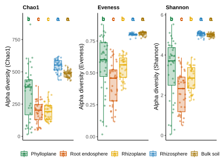
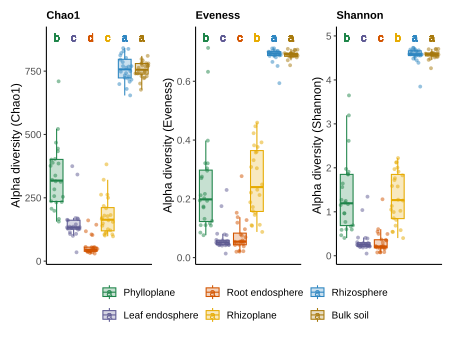

### Alpha-div by climat condition

I'm only going to look at the alpha diversity per condition with the Shannon index

```{r, AlphaDivShanonClimCondition16S,eval=F}
# For 16S
vec_compartment_l=levels(data_alphadiv$compartment_l)

PlotsAlpha = lapply(1:length(vec_compartment_l), function(i){
  
plot_x=stat_analyse(
    data=data_alphadiv %>% 
      data.frame() %>%  
      mutate(compartment_l=factor(compartment_l,levels=c("Phylloplane","Root endosphere","Rhizoplane","Rhizosphere","Bulk soil"))) %>% 
      filter(compartment_l==vec_compartment_l[i]),
    column_value = "data_shannon",
    category_variables = "climat_condition",
    grp_var = "",
    control_conditions = c("WW_OT"),
    show_plot = T,
    outlier_show = F, 
    label_outlier = "sample_name",
    hex_pallet = my_color_palette %>%
      filter(set == "climat_condition") %>%
      dplyr::select(color, treatment) %>%
      pull(color) %>%
      setNames(my_color_palette %>%
                 filter(set == "climat_condition") %>%
                 pull(treatment)
               ),

    biologist_stats = T,
    Ylab_i = paste0("Alpha diversity \n (Shannon Index)")
  )
  plot_x[["plot"]]+ 
    labs(
    subtitle = paste0(vec_compartment_l[i]),
    fill = "Climat Condition",
    color="Climat Condition"
    )+
    theme(axis.title.x = element_blank(),
          legend.position = "none",
          plot.subtitle = element_text(face = "bold")
          )
})

PlotsAlpha_resum_climat_cond=
  PlotsAlpha[1][[1]]+theme (axis.text.x=element_blank ())+
  PlotsAlpha[2][[1]]+theme (axis.text.x=element_blank ())+
  PlotsAlpha[3][[1]]+theme (axis.text.x=element_blank ())+
  PlotsAlpha[4][[1]]+#theme (axis.text.x=element_blank ())+
  PlotsAlpha[5][[1]]+
#  PlotsAlpha[6][[1]]+
  plot_layout(ncol = 2,guides = 'collect') + guide_area() & theme(legend.position = NULL) 

ggsave(here::here("report/mcom/plot/Alpha_diversity_Shannon_climat_condition.svg"),PlotsAlpha_resum_climat_cond ,width = 18,height = 18, units = "cm")
```

```{r, AlphaDivShanonClimConditionITS,eval=F}
# For ITS
vec_compartment_l=levels(data_alphadiv_ITS$compartment_l)

PlotsAlpha = lapply(1:length(vec_compartment_l), function(i){
  
plot_x=stat_analyse(
    data=data_alphadiv_ITS %>% 
      data.frame() %>%  
      mutate(compartment_l=factor(compartment_l,levels=c("Phylloplane","Leaf endosphere","Root endosphere","Rhizoplane","Rhizosphere","Bulk soil"))) %>% 
      filter(compartment_l==vec_compartment_l[i]),
    column_value = "data_shannon",
    category_variables = "climat_condition",
    grp_var = "",
    control_conditions = c("WW_OT"),
    show_plot = T,
    outlier_show = F, 
    label_outlier = "sample_name",
    hex_pallet = my_color_palette %>%
      filter(set == "climat_condition") %>%
      dplyr::select(color, treatment) %>%
      pull(color) %>%
      setNames(my_color_palette %>%
                 filter(set == "climat_condition") %>%
                 pull(treatment)
               ),

    biologist_stats = T,
    Ylab_i = paste0("Alpha diversity \n (Shannon Index)")
  )
  plot_x[["plot"]]+ 
    labs(
    subtitle = paste0(vec_compartment_l[i]),
    fill = "Climat Condition",
    color="Climat Condition"
    )+
    theme(axis.title.x = element_blank(),
          legend.position = "none",
          plot.subtitle = element_text(face = "bold")
          )
})

PlotsAlpha_resum_climat_cond=
  PlotsAlpha[1][[1]]+theme (axis.text.x=element_blank ())+
  PlotsAlpha[2][[1]]+theme (axis.text.x=element_blank ())+
  PlotsAlpha[3][[1]]+theme (axis.text.x=element_blank ())+
  PlotsAlpha[4][[1]]+theme (axis.text.x=element_blank ())+
  PlotsAlpha[5][[1]]+
  PlotsAlpha[6][[1]]+
#  PlotsAlpha[6][[1]]+
  plot_layout(ncol = 2,guides = 'collect') + guide_area() & theme(legend.position = NULL) 

ggsave(here::here("report/mcom/plot/Alpha_diversity_Shannon_climat_condition_ITS.svg"),PlotsAlpha_resum_climat_cond ,width = 18,height = 18, units = "cm")
```

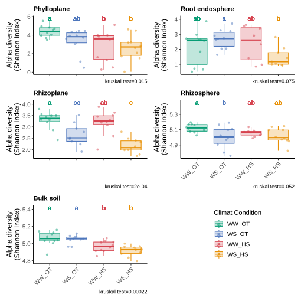

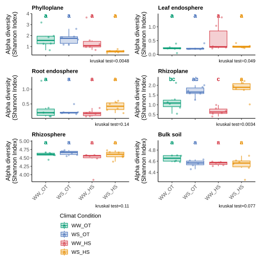

### Alpha-diversity ANOVA analyse

```{r, CalculAlphaDivANOVA16S,eval=F}
# For 16S
# Analyse of ANOVA 
M1=aov(data=data_alphadiv, data_evenness~compartment_l*genotype*water_condition*heat_condition)
anova_result=summary(M1)[[1]] %>% mutate(R2 = `Sum Sq` / sum(`Sum Sq`))

row_name<-rownames(anova_result)
row_name <- gsub("genotype","Genotype",row_name)
row_name <- gsub("water_condition","Water",row_name)
row_name <- gsub("heat_condition","Heat",row_name)
row_name <- gsub("compartment_l","Compartment",row_name)

rownames(anova_result)<-row_name

anova_result<-anova_result %>% 
  as.data.frame() %>% 
  rownames_to_column("contribution_variable") %>% 
  mutate(Significance = case_when(
    `Pr(>F)` <= 0.001 ~ '***',
    `Pr(>F)` < 0.01  ~ '**',
    `Pr(>F)` < 0.05  ~ '*',
    `Pr(>F)` < 0.1   ~ '.',
    TRUE            ~ ' '
  ))

compile_result=anova_result%>% 
  filter(str_detect(contribution_variable, "Total", negate = TRUE)) %>% 
  filter(str_detect(contribution_variable, "Residual", negate = TRUE)) %>% 
  mutate(contribution_variable = str_replace_all(contribution_variable, " ", "")) %>% 
  mutate_at(vars(contribution_variable), ~str_replace_all(., "\\$", ""))%>%
  mutate_at(vars(contribution_variable), ~str_replace_all(., "[0-9]", "")) %>% 
  mutate(contribution_variable = as.character(contribution_variable)) %>% 
  mutate(fontcolor = ifelse(contribution_variable %in% c("Water", "Genotype:Water:Heat", "Compartment"), "#ffffff", "#000000")) %>% 
  mutate(contribution_variable=fct_relevel(contribution_variable,c("Genotype","Water","Heat", "Genotype:Water","Genotype:Heat","Water:Heat","Genotype:Water:Heat","Compartment","Compartment:Genotype","Compartment:Water","Compartment:Heat","Compartment:Genotype:Water","Compartment:Genotype:Heat","Compartment:Water:Heat","Compartment:Genotype:Water:Heat"))) %>% 
  mutate(text_output=paste0(round(R2*100,0), "% ", Significance))

plot_contrib<-ggplot(compile_result, aes(x = "data", y = R2, fill = contribution_variable)) +
  geom_bar(stat = "identity") +
  geom_text(aes(label = ifelse(R2 > 0.02, text_output, "")), color = compile_result$fontcolor, position = position_stack(vjust = 0.5), size = 2.5)+
  scale_fill_manual(values = c("#ffd166", #geno
                               "#118ab2", #water
                               "#ef476f",#heat
                               "#06d6a0", #watergeno
                               "#f78c6b", #genoheat
                               "#FFB6C1", # waterheat
                               "#333333", manu_palett),
                    name = "title of legend (contribution") +#all
  scale_y_continuous(labels = scales::percent_format())+
  scale_color_identity()+
  labs(x = "Compartment",
       y = "The relative contribution for Alpha diversity (%)",
       subtitle = "Chao"
  ) +
  theme_minimal()+
  theme(panel.grid = element_blank(),
        legend.title = element_blank(), #for delete title
        #axis.text.x = element_text(angle = 45,hjust = 1, vjust = 1),
        axis.text.x=element_blank(),
        axis.title.x = element_blank()
  )

write.csv(file =  here::here("data/mcom/output/result_data_evenness_anova_compartment.csv"),x = compile_result)
ggsave(here::here("report/mcom/plot/Adiv_data_evenness_contribution_compartment.svg"), plot_contrib, width = 12, height = 12, units = "cm")

# compartment by compartment ----

method_i="data_shannon" #data_evenness #data_shannon # S.chao1
compile_result=as.data.frame(matrix(data=NA,nrow = 0, ncol = 8))
for (i in 1:length(levels(as.factor(data_alphadiv$compartment_l)))){
  compartment_l_i=as.character(levels(as.factor(data_alphadiv$compartment_l))[i])
  cat("method:",method_i,
      " Compartment:" ,compartment_l_i, 
      "\n")
  
  df_x= data_alphadiv  %>% 
    filter(compartment_l==compartment_l_i)
  
  formula_string <- as.formula(paste(method_i, "~", paste("genotype","*","water_condition","*","heat_condition", sep = "")))
  
  # Effectuer l'ANOVA à l'aide de la fonction aov
  result_compartment <- aov(data = df_x, formula = formula_string)
  anova_result=summary(result_compartment)[[1]] %>% mutate(R2 = `Sum Sq` / sum(`Sum Sq`))
  
  row_name<-rownames(anova_result)
  row_name <- gsub("genotype","Genotype",row_name)
  row_name <- gsub("water_condition","Water",row_name)
  row_name <- gsub("heat_condition","Heat",row_name)
  rownames(anova_result)<-row_name
  anova_result$compartment_l=as.character(df_x$compartment_l)[1]
  compile_result=rbind(compile_result,anova_result)

}


compile_result<-compile_result %>% 
  as.data.frame() %>% 
  rownames_to_column("contribution_variable") %>% 
  mutate(Significance = case_when(
    `Pr(>F)` <= 0.001 ~ '***',
    `Pr(>F)` < 0.01  ~ '**',
    `Pr(>F)` < 0.05  ~ '*',
    `Pr(>F)` < 0.1   ~ '.',
    TRUE            ~ ' '
  ))

vec_compartment_l_i=levels(as.factor(df_16S_metadata$compartment_l))

compile_result=compile_result%>% 
  filter(str_detect(contribution_variable, "Total", negate = TRUE)) %>% 
  filter(str_detect(contribution_variable, "Residual", negate = TRUE)) %>% 
  mutate(contribution_variable = str_replace_all(contribution_variable, " ", "")) %>% 
  mutate_at(vars(contribution_variable), ~str_replace_all(., "\\$", ""))%>%
  mutate_at(vars(contribution_variable), ~str_replace_all(., "[0-9]", "")) %>% 
  mutate(contribution_variable = as.character(contribution_variable)) %>% 
  mutate(fontcolor = ifelse(contribution_variable %in% c("Water", "Genotype:Water:Heat"), "#ffffff", "#000000")) %>% 
  mutate(compartment_l=fct_relevel(compartment_l,vec_compartment_l_i)) %>% 
  mutate(contribution_variable=fct_relevel(contribution_variable,c("Genotype","Water","Heat", "Genotype:Water","Genotype:Heat","Water:Heat","Genotype:Water:Heat"))) %>% 
  mutate(text_output=paste0(round(R2*100,0), "% ", Significance))

plot_contrib<-ggplot(compile_result, aes(x = compartment_l, y = R2, fill = contribution_variable)) +
  geom_bar(stat = "identity") +
  geom_text(aes(label = ifelse(R2 > 0.02, text_output, "")), color = compile_result$fontcolor, position = position_stack(vjust = 0.5), size = 2.5)+
  scale_fill_manual(values = c("#ffd166", #geno
                               "#118ab2", #water
                               "#ef476f",#heat
                               "#06d6a0", #watergeno
                               "#f78c6b", #genoheat
                               "#FFB6C1", # waterheat
                               "#333333"),
                    name = "title of legend (contribution") +#all
  scale_y_continuous(labels = scales::percent_format())+
  scale_color_identity()+
  labs(x = "Compartment",
       y = "The relative contribution for Alpha diversity (%)",
       caption = paste0("(",method_i,")")) +
  theme_minimal()+
  theme(panel.grid = element_blank(),
        legend.title = element_blank(), #for delete title
        axis.text.x = element_text(angle = 45,hjust = 1, vjust = 1),
        axis.title.x = element_blank()
  )

write.csv(file =  here::here(paste0("data/mcom/output/alpha_result_",method_i,"_anova.csv")),x = compile_result)
ggsave(here::here(paste0("report/mcom/plot/Adiv_",method_i,"_contribution.svg")), plot_contrib,width = 12,height = 12, units = "cm")
```

```{r, CalculAlphaDivANOVAITS,eval=F}
# For ITS
# Analyse of ANOVA 
M1=aov(data=data_alphadiv_ITS, data_shannon~compartment_l*genotype*water_condition*heat_condition)
anova_result=summary(M1)[[1]] %>% mutate(R2 = `Sum Sq` / sum(`Sum Sq`))

row_name<-rownames(anova_result)
row_name <- gsub("genotype","Genotype",row_name)
row_name <- gsub("water_condition","Water",row_name)
row_name <- gsub("heat_condition","Heat",row_name)
row_name <- gsub("compartment_l","Compartment",row_name)

rownames(anova_result)<-row_name

anova_result<-anova_result %>% 
  as.data.frame() %>% 
  rownames_to_column("contribution_variable") %>% 
  mutate(Significance = case_when(
    `Pr(>F)` <= 0.001 ~ '***',
    `Pr(>F)` < 0.01  ~ '**',
    `Pr(>F)` < 0.05  ~ '*',
    `Pr(>F)` < 0.1   ~ '.',
    TRUE            ~ ' '
  ))

compile_result=anova_result%>% 
  filter(str_detect(contribution_variable, "Total", negate = TRUE)) %>% 
  filter(str_detect(contribution_variable, "Residual", negate = TRUE)) %>% 
  mutate(contribution_variable = str_replace_all(contribution_variable, " ", "")) %>% 
  mutate_at(vars(contribution_variable), ~str_replace_all(., "\\$", ""))%>%
  mutate_at(vars(contribution_variable), ~str_replace_all(., "[0-9]", "")) %>% 
  mutate(contribution_variable = as.character(contribution_variable)) %>% 
  mutate(fontcolor = ifelse(contribution_variable %in% c("Water", "Genotype:Water:Heat", "Compartment"), "#ffffff", "#000000")) %>% 
  mutate(contribution_variable=fct_relevel(contribution_variable,c("Genotype","Water","Heat", "Genotype:Water","Genotype:Heat","Water:Heat","Genotype:Water:Heat","Compartment","Compartment:Genotype","Compartment:Water","Compartment:Heat","Compartment:Genotype:Water","Compartment:Genotype:Heat","Compartment:Water:Heat","Compartment:Genotype:Water:Heat"))) %>% 
  mutate(text_output=paste0(round(R2*100,0), "% ", Significance))

plot_contrib<-ggplot(compile_result, aes(x = "data", y = R2, fill = contribution_variable)) +
  geom_bar(stat = "identity") +
  geom_text(aes(label = ifelse(R2 > 0.02, text_output, "")), color = compile_result$fontcolor, position = position_stack(vjust = 0.5), size = 2.5)+
  scale_fill_manual(values = c("#ffd166", #geno
                               "#118ab2", #water
                               "#ef476f",#heat
                               "#06d6a0", #watergeno
                               "#f78c6b", #genoheat
                               "#FFB6C1", # waterheat
                               "#333333", manu_palett),
                    name = "title of legend (contribution") +#all
  scale_y_continuous(labels = scales::percent_format())+
  scale_color_identity()+
  labs(x = "Compartment",
       y = "The relative contribution for Alpha diversity (%)",
       subtitle = "Shannon"
  ) +
  theme_minimal()+
  theme(panel.grid = element_blank(),
        legend.title = element_blank(), #for delete title
        #axis.text.x = element_text(angle = 45,hjust = 1, vjust = 1),
        axis.text.x=element_blank(),
        axis.title.x = element_blank()
  )

write.csv(file =  here::here("data/mcom/output/result_data_shannon_anova_compartment_ITS.csv"),x = compile_result)
ggsave(here::here("report/mcom/plot/Adiv_data_shannon_contribution_compartment_ITS.svg"), plot_contrib, width = 12, height = 12, units = "cm")

# compartment by compartment ----

method_i="data_shannon" #data_evenness #data_shannon # S.chao1
compile_result=as.data.frame(matrix(data=NA,nrow = 0, ncol = 8))
for (i in 1:length(levels(as.factor(data_alphadiv_ITS$compartment_l)))){
  compartment_l_i=as.character(levels(as.factor(data_alphadiv_ITS$compartment_l))[i])
  cat("method:",method_i,
      " Compartment:" ,compartment_l_i, 
      "\n")
  
  df_x= data_alphadiv_ITS  %>% 
    filter(compartment_l==compartment_l_i)
  
  formula_string <- as.formula(paste(method_i, "~", paste("genotype","*","water_condition","*","heat_condition", sep = "")))
  
  # Effectuer l'ANOVA à l'aide de la fonction aov
  result_compartment <- aov(data = df_x, formula = formula_string)
  anova_result=summary(result_compartment)[[1]] %>% mutate(R2 = `Sum Sq` / sum(`Sum Sq`))
  
  row_name<-rownames(anova_result)
  row_name <- gsub("genotype","Genotype",row_name)
  row_name <- gsub("water_condition","Water",row_name)
  row_name <- gsub("heat_condition","Heat",row_name)
  rownames(anova_result)<-row_name
  anova_result$compartment_l=as.character(df_x$compartment_l)[1]
  compile_result=rbind(compile_result,anova_result)

}


compile_result<-compile_result %>% 
  as.data.frame() %>% 
  rownames_to_column("contribution_variable") %>% 
  mutate(Significance = case_when(
    `Pr(>F)` <= 0.001 ~ '***',
    `Pr(>F)` < 0.01  ~ '**',
    `Pr(>F)` < 0.05  ~ '*',
    `Pr(>F)` < 0.1   ~ '.',
    TRUE            ~ ' '
  ))

vec_compartment_l_i=levels(as.factor(df_ITS_metadata$compartment_l))

compile_result=compile_result%>% 
  filter(str_detect(contribution_variable, "Total", negate = TRUE)) %>% 
  filter(str_detect(contribution_variable, "Residual", negate = TRUE)) %>% 
  mutate(contribution_variable = str_replace_all(contribution_variable, " ", "")) %>% 
  mutate_at(vars(contribution_variable), ~str_replace_all(., "\\$", ""))%>%
  mutate_at(vars(contribution_variable), ~str_replace_all(., "[0-9]", "")) %>% 
  mutate(contribution_variable = as.character(contribution_variable)) %>% 
  mutate(fontcolor = ifelse(contribution_variable %in% c("Water", "Genotype:Water:Heat"), "#ffffff", "#000000")) %>% 
  mutate(compartment_l=fct_relevel(compartment_l,vec_compartment_l_i)) %>% 
  mutate(contribution_variable=fct_relevel(contribution_variable,c("Genotype","Water","Heat", "Genotype:Water","Genotype:Heat","Water:Heat","Genotype:Water:Heat"))) %>% 
  mutate(text_output=paste0(round(R2*100,0), "% ", Significance))

plot_contrib<-ggplot(compile_result, aes(x = compartment_l, y = R2, fill = contribution_variable)) +
  geom_bar(stat = "identity") +
  geom_text(aes(label = ifelse(R2 > 0.02, text_output, "")), color = compile_result$fontcolor, position = position_stack(vjust = 0.5), size = 2.5)+
  scale_fill_manual(values = c("#ffd166", #geno
                               "#118ab2", #water
                               "#ef476f",#heat
                               "#06d6a0", #watergeno
                               "#f78c6b", #genoheat
                               "#FFB6C1", # waterheat
                               "#333333"),
                    name = "title of legend (contribution") +#all
  scale_y_continuous(labels = scales::percent_format())+
  scale_color_identity()+
  labs(x = "Compartment",
       y = "The relative contribution for Alpha diversity (%)",
       caption = paste0("(",method_i,")"),subtitle = "ITS") +
  theme_minimal()+
  theme(panel.grid = element_blank(),
        legend.title = element_blank(), #for delete title
        axis.text.x = element_text(angle = 45,hjust = 1, vjust = 1),
        axis.title.x = element_blank()
  )

write.csv(file =  here::here(paste0("data/mcom/output/alpha_result_",method_i,"_anova_ITS.csv")),x = compile_result)
ggsave(here::here(paste0("report/mcom/plot/Adiv_",method_i,"_contribution_ITS.svg")), plot_contrib,width = 12,height = 12, units = "cm")
```

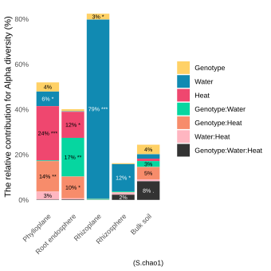
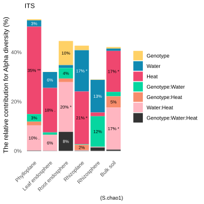

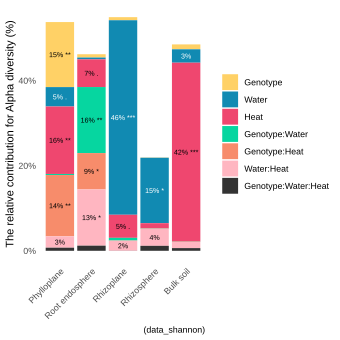
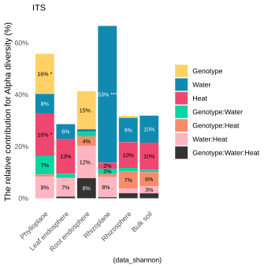

We can use **Analysis of variance** (ANOVA) to tell if at least one of the diversity means is different from the rest.

```{r, AlphaANOVA ,message=FALSE,warning=F}
# For 16S
anova_result <- aov(data_shannon ~ compartment*genotype*water_condition*heat_condition,data=data_alphadiv)
#summary(anova_result)
table_out<-tab_model(anova_result)
table_out$table_body$width[1] <- "600%"   # Increase the width of the first column
table_out

# For ITS
anova_result <- aov(data_shannon ~ compartment*genotype*water_condition*heat_condition,data=data_alphadiv_ITS)
#summary(anova_result)
table_out<-tab_model(anova_result)
table_out$table_body$width[1] <- "600%"   # Increase the width of the first column
table_out
```

## Phyloseq & Rarefaction

### Creation of the phyloseq object

```{r, CreationPhyloseqObject}
vec_ASV<-df_16S_count %>% rownames_to_column("ASV") %>%  pull(ASV)
vec_ASV_ITS<-df_ITS_count %>% rownames_to_column("ASV") %>%  pull(ASV)

df_16S_taxonomy=df_16S_taxonomy %>% 
  filter(ASV %in% vec_ASV) %>% 
  column_to_rownames("ASV")
df_ITS_taxonomy=df_ITS_taxonomy %>% 
  filter(ASV %in% vec_ASV_ITS) %>% 
  column_to_rownames("ASV")

asv1<-otu_table(df_16S_count, taxa_are_rows = TRUE)
asv1ITS<-otu_table(df_ITS_count, taxa_are_rows = TRUE)

tax1 <- tax_table(as.matrix(df_16S_taxonomy))
tax1ITS <- tax_table(as.matrix(df_ITS_taxonomy))

map1 <- sample_data(df_16S_metadata %>% 
    mutate("sample"=sample_name) %>% 
    column_to_rownames("sample_name") %>% 
    rename("sample_name"=sample))
map1ITS <- sample_data(df_ITS_metadata %>% 
    mutate("sample"=sample_name) %>% 
    column_to_rownames("sample_name") %>% 
    rename("sample_name"=sample))

phyl=df_16S_rooted_tree
phylITS=df_ITS_rooted_tree

phyloseq_16S<- phyloseq(asv1, map1, tax1,phyl)
phyloseq_ITS<- phyloseq(asv1ITS, map1ITS, tax1ITS,phylITS)

rm(vec_ASV,asv1,tax1,map1,phyl,vec_ASV_ITS,asv1ITS,tax1ITS,map1ITS,phylITS) 
```

In the remainder of the data analyses we want to focus on the differences between the samples, the bacterial community composition and the beta-diversity. For this it is necessary to prepare the data in a way that improves the comparability of the samples. As microbiome data sets are usually sparse, it is important to filter the data set. Indeed, data filtering aims to remove low quality or uninformative variables (ASV) to improve downstream statistical analysis. For example, we can filter variables ASV with very low number of counts in only a few samples, which are likely due to sequencing errors or low-level contaminations. In this analyse, we will keep ASV that have at least 2 counts in at least 0.8% of the samples. Indeed, we have here 236 samples and 4-5 replicates per treatment and we want, for example, to have at least 2 counts in at least two samples (2/236=0.00847).

Filter the ASV data using filter_taxa function included in phyloseq package

First, data filtering should be done on the raw data. Then, we are using here the phyloseq object: phyloseq_16S because we are using a plyloseq function to filter the raw data.

```{r, FilterLowCount2}
# filter the ASV data using filter_taxa function included in phyloseq package
phyloseq_16S_filt = phyloseq::filter_taxa(phyloseq_16S, function(x) sum(x > 2) > (0.008 * length(x)), TRUE) 
phyloseq_ITS_filt = phyloseq::filter_taxa(phyloseq_ITS, function(x) sum(x > 2) > (0.008 * length(x)), TRUE) 

df_16S_count_filt = data.frame(otu_table(phyloseq_16S_filt)) %>% 
  rename_all(~substring(., 2))
df_ITS_count_filt = data.frame(otu_table(phyloseq_ITS_filt)) %>% 
  rename_all(~substring(., 2))
# dim(df_16S_count_filt)
# dim(data.frame(otu_table(phyloseq_16S)))
df_16S_data_loss<-collect_mcom_counts(storage = df_16S_data_loss, df_i = df_16S_count_filt,new_column_name = "filter_low_count")

# test=df_16S_data_loss %>%
#   pivot_longer(-sample_name,names_to = "step",values_to = 'count') %>%
#   left_join(.,df_16S_metadata, by="sample_name") %>%
#   filter(step=="filter_low_count") %>%
#   drop_na(count) %>%
#   dplyr::group_by(compartment_l,condition) %>%
#         dplyr::summarise(mean_count = mean(count,na.rm = TRUE),
#                          N=n(),
#                          sd=sd(count,na.rm = TRUE),
#                          se=sd(count,na.rm = TRUE)/sqrt(N),
#                          min=min(count),
#                          .groups = "drop")
```

I need to rarefy or normalise the data. Because I have very different sample counts. This could lead to bias when measuring ecological distances, for example.

-   There are still **`r dim(df_16S_count_filt)[2]`** samples and there are now **`r dim(df_16S_count_filt)[1]`** ASV for bacteria. For Fungi, **`r dim(df_ITS_count_filt)[2]`** samples and there are now **`r dim(df_ITS_count_filt)[1]`**
-   For bacteria (16S) the non filtered ASV table has **`r dim(df_16S_count)[2]`** sample and **`r dim(df_16S_count)[1]`** ASV, so we removed here **`r dim(df_16S_count)[1] - dim(df_16S_count_filt)[1]`** ASV, representing almost **`r round((dim(df_16S_count_filt)[1] - dim(df_16S_count)[1])*100/dim(df_16S_count)[1],2)`%** of the features. For Fungy (ITS) the non filtered ASV table has **`r dim(df_ITS_count)[2]`** sample and **`r dim(df_ITS_count)[1]`** ASV, so we removed here **`r dim(df_ITS_count)[1] - dim(df_ITS_count_filt)[1]`** ASV, representing almost **`r round((dim(df_ITS_count_filt)[1] - dim(df_ITS_count)[1])*100/dim(df_ITS_count)[1],2)`%** of the features.
-   For bacteria, total number of sequences/reads in the filtered data : **`r format(sum(df_16S_count_filt), scientific = TRUE)`**. For Fungy (ITS) is **`r format(sum(df_ITS_count_filt), scientific = TRUE)`**.
-   Percentage of sequences/reads removed during filtering step : **`r ((sum(df_16S_count)-sum(df_16S_count_filt))/sum(df_16S_count))*100`%** for bacteria and **`r ((sum(df_ITS_count)-sum(df_ITS_count_filt))/sum(df_ITS_count))*100`%** for fungy (ITS).

### Normalization per sample

In the further analyses, we will compare counts between samples. To do so, we will have first to normalise the filtered occurrence table by sample in order to obtain the same library size for every samples. Different methods exist to normalise microbiome data: proportions and rarefying were commonly used for long time but other methods were also developed, such as DESeq2 or edgeR‐TMM, which are commonly used in RNA-seq data analyses. While there is still no consensus on which normalisation method should be used for microbiome data, microbial ecologists prefer the proportion or the **rarefying** methods. Indeed, as explained @mcknight_methods_2019 DESeq2 or edgeR‐TMM are recommended based on studies that focused on differential abundance testing and variance standardization, rather than community-level comparisons (i.e. beta-diversity). Moreover, standardizing the within-sample variance across samples may suppress differences in species evenness, potentially distorting community level patterns, and the log transformations can exaggerate the importance of differences among rare ASV, while suppressing the importance of differences among abondant ASV. For proportion, each read count is divided by the total sum of all reads of the corresponding sample. As a results, read sums for all the different samples are then equal to 1 and ASV occurrences are between 0 and 1.

which one to choose?

-   No modification of the count ... the worst -
-   normalisation, @beule_improved_2020 For subsampling , package call SRS (Scaling with ranked subsampl) - Some peoples like rarefaction methode and is use often in microbial analyse - Deseq2, for variance stabilizing transformation.
-   @mcmurdie_waste_2014-1 Publication that argues the do to use desq2 for microbial communities analysis) @schloss_waste_nodate Normalisation an acceptable alternative to rarefactions ? NO !!!
-   @cameron_enhancing_2021

Differences in library sizes of amplicon sequencing datasets do not represent true biological variation. The differences observed between library sizes of different samples requires a method to control and correct for to allow for diversity analyses to be conducted accurately. Rarefying is a common normalization technique that implements the random subsampling of libraries to create rarefied libraries. However, despite the frequent usage of rarefying, it has recently been criticized for being statistically inadmissable due to the omission of valid data @mcmurdie_waste_2014-1. While we acknowledge that rarefying has the potential to introduce variation through the omission of sequences, rarefying is a statistical tool that when handled carefully and with the necessary understanding of your data that can be implemented succesfully for diversity analyses when applied over multiple iterations. This package, mirlyn, provides the necessary functions to conduct diversity analyses with repeated multiple iterations of rarefying to characterize the uncertainty introduced through the random subsampling of rarefying.

A variety of normalization techniques have been proposed for amplicon sequencing data. It is strongly advised that you review literature resources to ensure that you make an educated decision about the normalization techniques you are applying to your data.

Suggested Resources:

-   @cameron_enhancing_2021
-   @mcmurdie_waste_2014
-   @weiss_normalization_2017

Rarefying without replacement is better according to @cameron_enhancing_2021. To compare each compartment with the others, we performed a rarefaction on all samples with a rarefaction of the smallest library. (16000). In order to have the largest possible normalized libraries and thus detect greater diversity while having minimal variation between random rarefaction iterations. We performed a rarefaction for each compartment (i.e. rarefaction of the smallest library in each compartment).

```{r, DataFiltering}
# For 16S
min_df_16S_count_filt<-min(data.frame(otu_table(phyloseq_16S_filt)) %>% 
  rownames_to_column("ASV") %>% 
  pivot_longer(-ASV, names_to = "sample_name", values_to = "count") %>% 
  dplyr::group_by(sample_name) %>% 
  summarise(total=sum(count),.groups = "drop") %>% 
  arrange(total) %>% 
  pull(total))

kable(data.frame(otu_table(phyloseq_16S_filt)) %>% 
  rownames_to_column("ASV") %>% 
  pivot_longer(-ASV, names_to = "sample_name", values_to = "count") %>% 
  mutate(sample_name = substr(sample_name, 2, nchar(sample_name))) %>% 
  inner_join(.,df_16S_metadata, by="sample_name") %>% 
  dplyr::group_by(sample_name, compartment, condition) %>% 
  dplyr::summarise(total=sum(count),.groups = "drop") %>% 
  filter(total>16000) %>% 
  dplyr::group_by(compartment, condition) %>% 
  dplyr::summarise(n=n(),.groups = "drop") %>% 
  arrange(n) %>% 
    head(10),
  format = "html", 
  caption = "10 lowest number of samples after filtering per condition") 

# For ITS
min_df_ITS_count_filt<-min(data.frame(otu_table(phyloseq_ITS_filt)) %>% 
  rownames_to_column("ASV") %>% 
  pivot_longer(-ASV, names_to = "sample_name", values_to = "count") %>% 
  dplyr::group_by(sample_name) %>% 
  summarise(total=sum(count),.groups = "drop") %>% 
  arrange(total) %>% 
  pull(total))

kable(data.frame(otu_table(phyloseq_ITS_filt)) %>% 
  rownames_to_column("ASV") %>% 
  pivot_longer(-ASV, names_to = "sample_name", values_to = "count") %>% 
  mutate(sample_name = substr(sample_name, 2, nchar(sample_name))) %>% 
  inner_join(.,df_ITS_metadata, by="sample_name") %>% 
  dplyr::group_by(sample_name, compartment, condition) %>% 
  dplyr::summarise(total=sum(count),.groups = "drop") %>% 
  filter(total>16000) %>% 
  dplyr::group_by(compartment, condition) %>% 
  dplyr::summarise(n=n(),.groups = "drop") %>% 
  arrange(n) %>% 
    head(10),
  format = "html", 
  caption = "10 lowest number of samples after filtering per condition") 
```

For rarefying, the library size is arbritary defined for every samples as the **smallest library size** observed for all the samples (here,**`r min_df_16S_count_filt`** for bacteria and **`r min_df_ITS_count_filt`** for fungy). Then, simple random samples without replacement are performed for every sample using the raw data.

When differences between library sizes is high (such as 10 fold change), it is recommended to use rarefying. As we usually observe 10 fold change in the library sizes, we will normalize here using the rarefying method. The normalization should be done on the filtered data, the phyloseq object *data_phylo_filt*.

**To look at the differences between compartments, I use a rarefaction based on the sample with the fewest accounts. That is 16000 conte for bacteria and 80000 for fungi.**

```{r, Rarefaction,message=F}
# To compare the individual compartments
set.seed(1) # set seed for analysis reproducibility
# ASV_16S_filt_rar_1800 = rarefy_even_depth(otu_table(phyloseq_16S_filt), rngseed = TRUE, replace = FALSE,sample.size = 1800) # rarefy the raw data using Phyloseq package
# df_16S_count_filt_rar_1800 = data.frame(otu_table(ASV_16S_filt_rar_1800)) %>% rename_all(~substring(., 2)) # create a separated file
# #phyloseq_16S_filt_rar_1800 <- phyloseq::phyloseq(ASV_16S_filt_rar_1800, tax1, map1) # create a phyloseq object
# phyloseq_16S_filt_rar_1800 <- phyloseq::phyloseq(ASV_16S_filt_rar_1800, tax_table(phyloseq_16S), sample_data(phyloseq_16S),phy_tree(phyloseq_16S)) # create a phyloseq object

# For 16S
ASV_16S_filt_rar_16000 = rarefy_even_depth(otu_table(phyloseq_16S_filt), rngseed = TRUE, replace = FALSE,sample.size = 16000) # rarefy the raw data using Phyloseq package
df_16S_count_filt_rar_16000 = data.frame(otu_table(ASV_16S_filt_rar_16000)) %>% rename_all(~substring(., 2)) # create a separated file
phyloseq_16S_filt_rar_16000 <- phyloseq::phyloseq(ASV_16S_filt_rar_16000, tax_table(phyloseq_16S), sample_data(phyloseq_16S),phy_tree(phyloseq_16S)) # create a phyloseq object

rm(ASV_16S_filt_rar_16000,tax1,map1)
#sum(rowSums(df_16S_count_filt_rar))

#df_16S_data_loss<-collect_mcom_counts(storage = df_16S_data_loss, df_i = df_16S_count_filt_rar_1800,new_column_name = "df_16S_filt_rar_1800")
df_16S_data_loss<-collect_mcom_counts(storage = df_16S_data_loss, df_i = df_16S_count_filt_rar_16000,new_column_name = "df_16S_filt_rar_16000")
save(df_16S_count_filt_rar_16000,file=here::here(paste0("data/mcom/output/save/df_16S_count_filt_rar_16000_diversity_rarefaction.RData")))

# For ITS
ASV_ITS_filt_rar_80000 = rarefy_even_depth(otu_table(phyloseq_ITS_filt), rngseed = TRUE, replace = FALSE,sample.size = 80000) # rarefy the raw data using Phyloseq package
df_ITS_count_filt_rar_80000 = data.frame(otu_table(ASV_ITS_filt_rar_80000)) %>% rename_all(~substring(., 2)) # create a separated file
phyloseq_ITS_filt_rar_80000 <- phyloseq::phyloseq(ASV_ITS_filt_rar_80000, tax_table(phyloseq_ITS), sample_data(phyloseq_ITS),phy_tree(phyloseq_ITS)) # create a phyloseq object

rm(ASV_ITS_filt_rar_80000,tax1,map1)
#sum(rowSums(df_16S_count_filt_rar))

save(df_16S_count_filt_rar_16000,file=here::here(paste0("data/mcom/output/save/df_16S_count_filt_rar_16000_diversity_rarefaction.RData")))
save(df_ITS_count_filt_rar_80000,file=here::here(paste0("data/mcom/output/save/df_ITS_count_filt_rar_80000_diversity_rarefaction.RData")))
```

Now the number of counts per sample for the rarefied data set is **`r format(sum(rowSums(df_16S_count_filt_rar_16000)), scientific = TRUE)`** for bacteria and  **`r format(sum(rowSums(df_ITS_count_filt_rar_80000)), scientific = TRUE)`** for fungy. 

## Beta-diversity

While alpha-diversity represents the diversity within an ecosystem or a sample, beta-diversity represents the difference between two ecosystems/samples. In other word, how similar or different are two ecosystems or samples? So, beta-diversity is a distance between two communities. Microbial ecologists do not use Euclidean distances but usually use Bray-Curtis, Jaccard or weight/unweight Unifrac distances to estimate the betadiversity.

The Bray-Curtis dissimilarity is based on occurrence data (abundance), while the Jaccard distance is based on presence/absence data (does not include abundance information). UniFrac distances take into account the occurrence table and the phylogeny diversity (sequence distance). Weighted or unweighted UniFrac distances depending if taking into account relative abundance or only presence/absence. Distances metrics are between 0 and 1: 0 means identical communities in both samples and 1 means different communities in both samples.

The vegan function vegdist is used to calculate the pairwise beta diversity indexes for a set of samples. Since this is a pairwise comparison, the output is a triangular matrix. In R, a matrix is like a data.frame, but all of the same type (e.g. all numeric), and has some different behavior.

Remove some information beacause a lot of variation only in two axis.

Two methode available in the vegan R package:

-   Adonis (or AMOVA or Permanova) To see if clouds of points have the same centroid whether or not they overlap in the same spot.
-   Permdist, or Beta to spur or homeova. Allow us to see whether or not the variation in the data varies between different sampling group. For example, this is my case for the comparison between compartments. Bulk soil and Rhizosphe are less dispersed compared to the four other compartment.

Beta-diversity is calculated on filtered and normalized data tables: the *df_16S_count_filt_rar* or *df_ITS_count_filt_rar* data table or the phyloseq object *phyloseq_16S_filt_rar* or *phyloseq_ITS_filt_rar* but i prefere to use raw data filtered and use avgdist with take more time but use more information to create graphe.

### Beta-diversity by compartment

I calculate Bray-Curtis distance using the vegan package. I use the *df_16S_count_filt* and rarefaction at 16000 for compare compartment for bacteria and i use **df_ITS_count_filt** and rarefaction at 80000 for compare compartment for fungy. 

```{r, BdivBrayCurtisCompartment16S, eval=F}
# For 16S
# /!\ take time ~5min for avgdist
set.seed(1)
permutation_i=10000 # really more precise when this number is large

df_x<- df_16S_count_filt  %>% 
  t() %>% 
  vegan::avgdist(sample=16000,iterations = 100) 

#write.csv(as.dist(dist_metric_compartment),here::here("data/output/beta_div_bray_curtis.csv"))

source(here::here("src/function/Bdiv_NMDS.R")) 
#ggsave(here::here("plot/Bdiv_UniFrac_NMDS_weighted_WW_OT.svg"),Bdiv_NMDS(phyloseq::distance(phyloseq_16S_filt_rar_16000, method = "unifrac", weighted = T))+labs(subtitle = "UnifracDist Weighted"),width = 20,height = 15, units = "cm")

# plot_x=Bdiv_NMDS(df_x)+labs(subtitle = "Bray-Curtis distance")
# ggsave(here::here("plot/Bdiv_Bray_Curt_NMDS.svg"),plot_x ,width = 20,height = 15, units = "cm")

# for PERMANOVA results Bray-Curtis ----
dist_metric_compartment<- df_x %>% 
  as.matrix() %>% 
  as.data.frame(optional = TRUE) %>% #add rowname from matrix
  rownames_to_column("sample_name") %>% 
  inner_join(.,df_16S_metadata %>%
               dplyr::select(sample_name,compartment_l,genotype,water_condition,heat_condition),by="sample_name")
  
result_adonis_anova.cca<-adonis2(as.dist(dist_metric_compartment%>%
                                           dplyr::select(-c(compartment_l,genotype,water_condition,heat_condition)) %>% 
                                           column_to_rownames("sample_name")
                                         )~
                         compartment_l*                      
                         genotype*
                         water_condition*
                         heat_condition,
                         data=dist_metric_compartment,
                        permutations = permutation_i)
  
row_name<-rownames(result_adonis_anova.cca)
row_name <- gsub("genotype","Genotype",row_name)
row_name <- gsub("water_condition","Water",row_name)
row_name <- gsub("heat_condition","Heat",row_name)
row_name <- gsub("compartment_l","Compartment",row_name)

rownames(result_adonis_anova.cca)<-row_name

result_adonis_anova.cca<-result_adonis_anova.cca %>% 
  as.data.frame() %>% 
  rownames_to_column("contribution_variable") %>% 
  mutate(Significance = case_when(
    `Pr(>F)` <= 0.001 ~ '***',
    `Pr(>F)` < 0.01  ~ '**',
    `Pr(>F)` < 0.05  ~ '*',
    `Pr(>F)` < 0.1   ~ '.',
    TRUE            ~ ' '
  ))

compile_result_bray_curtis=result_adonis_anova.cca%>% 
  filter(str_detect(contribution_variable, "Total", negate = TRUE)) %>% 
  filter(str_detect(contribution_variable, "Residual", negate = TRUE)) %>% 
  mutate_at(vars(contribution_variable), ~str_replace_all(., "\\$", ""))%>%
  mutate_at(vars(contribution_variable), ~str_replace_all(., "[0-9]", "")) %>% 
  mutate(contribution_variable = as.character(contribution_variable)) %>% 
  mutate(fontcolor = ifelse(contribution_variable %in% c("Water", "Genotype:Water:Heat", "Compartment"), "#ffffff", "#000000")) %>% 
  mutate(contribution_variable=fct_relevel(contribution_variable,c("Genotype","Water","Heat", "Genotype:Water","Genotype:Heat","Water:Heat","Genotype:Water:Heat","Compartment","Compartment:Genotype","Compartment:Water","Compartment:Heat","Compartment:Genotype:Water","Compartment:Genotype:Heat","Compartment:Water:Heat","Compartment:Genotype:Water:Heat"))) %>% 
mutate(text_output=paste0(round(R2*100,0), "% ", Significance))

plot_contrib<-ggplot(compile_result_bray_curtis, aes(x = "data", y = R2, fill = contribution_variable)) +
  geom_bar(stat = "identity") +
  geom_text(aes(label = ifelse(R2 > 0.02, text_output, "")), color = compile_result_bray_curtis$fontcolor, position = position_stack(vjust = 0.5), size = 2.5)+
  scale_fill_manual(values = c("#ffd166", #geno
                               "#118ab2", #water
                               "#ef476f",#heat
                               "#06d6a0", #watergeno
                               "#f78c6b", #genoheat
                               "#FFB6C1", # waterheat
                               "#333333", manu_palett),
                    name = "title of legend (contribution") +#all
 scale_y_continuous(labels = scales::percent_format())+
   scale_color_identity()+
labs(x = "Compartment",
     y = "The relative contribution for Beta diversity (%)",
     subtitle = ("Bray-Curtis distance contribution for 16S")
     ) +
  theme_minimal()+
  theme(panel.grid = element_blank(),
        legend.title = element_blank(), #for delete title
        #axis.text.x = element_text(angle = 45,hjust = 1, vjust = 1),
        axis.text.x=element_blank(),
        axis.title.x = element_blank()
        )

write.csv(file =  here::here("data/mcom/output/result_bray_curt_anova_compartment.csv"),x = compile_result_bray_curtis %>% dplyr::select(contribution_variable,R2, F, Df,`Pr(>F)`))
ggsave(here::here("report/mcom/plot/Bdiv_Bray_Curt_contribution_compartment.svg"), plot_contrib,width = 12,height = 12, units = "cm")
```


```{r, BdivBrayCurtisCompartmentITS, eval=F}
# For ITS
# /!\ take time ~5min for avgdist
set.seed(1)
permutation_i=10000 # really more precise when this number is large

df_x<- df_ITS_count_filt  %>% 
  t() %>% 
  vegan::avgdist(sample=80000,iterations = 100) 

#write.csv(as.dist(dist_metric_compartment),here::here("data/output/beta_div_bray_curtis.csv"))

source(here::here("src/function/Bdiv_NMDS.R")) 
#ggsave(here::here("plot/Bdiv_UniFrac_NMDS_weighted_WW_OT.svg"),Bdiv_NMDS(phyloseq::distance(phyloseq_16S_filt_rar_16000, method = "unifrac", weighted = T))+labs(subtitle = "UnifracDist Weighted"),width = 20,height = 15, units = "cm")

# plot_x=Bdiv_NMDS(df_x, type=ITS)+labs(subtitle = "Bray-Curtis distance")
# ggsave(here::here("plot/Bdiv_Bray_Curt_NMDS.svg"),plot_x ,width = 20,height = 15, units = "cm")

# for PERMANOVA results Bray-Curtis ----
dist_metric_compartment<- df_x %>% 
  as.matrix() %>% 
  as.data.frame(optional = TRUE) %>% #add rowname from matrix
  rownames_to_column("sample_name") %>% 
  inner_join(.,df_ITS_metadata %>%
               dplyr::select(sample_name,compartment_l,genotype,water_condition,heat_condition),by="sample_name")
  
result_adonis_anova.cca<-adonis2(as.dist(dist_metric_compartment%>%
                                           dplyr::select(-c(compartment_l,genotype,water_condition,heat_condition)) %>% 
                                           column_to_rownames("sample_name")
                                         )~
                         compartment_l*                      
                         genotype*
                         water_condition*
                         heat_condition,
                         data=dist_metric_compartment,
                        permutations = permutation_i)
  
row_name<-rownames(result_adonis_anova.cca)
row_name <- gsub("genotype","Genotype",row_name)
row_name <- gsub("water_condition","Water",row_name)
row_name <- gsub("heat_condition","Heat",row_name)
row_name <- gsub("compartment_l","Compartment",row_name)

rownames(result_adonis_anova.cca)<-row_name

result_adonis_anova.cca<-result_adonis_anova.cca %>% 
  as.data.frame() %>% 
  rownames_to_column("contribution_variable") %>% 
  mutate(Significance = case_when(
    `Pr(>F)` <= 0.001 ~ '***',
    `Pr(>F)` < 0.01  ~ '**',
    `Pr(>F)` < 0.05  ~ '*',
    `Pr(>F)` < 0.1   ~ '.',
    TRUE            ~ ' '
  ))

compile_result_bray_curtis=result_adonis_anova.cca%>% 
  filter(str_detect(contribution_variable, "Total", negate = TRUE)) %>% 
  filter(str_detect(contribution_variable, "Residual", negate = TRUE)) %>% 
  mutate_at(vars(contribution_variable), ~str_replace_all(., "\\$", ""))%>%
  mutate_at(vars(contribution_variable), ~str_replace_all(., "[0-9]", "")) %>% 
  mutate(contribution_variable = as.character(contribution_variable)) %>% 
  mutate(fontcolor = ifelse(contribution_variable %in% c("Water", "Genotype:Water:Heat", "Compartment"), "#ffffff", "#000000")) %>% 
  mutate(contribution_variable=fct_relevel(contribution_variable,c("Genotype","Water","Heat", "Genotype:Water","Genotype:Heat","Water:Heat","Genotype:Water:Heat","Compartment","Compartment:Genotype","Compartment:Water","Compartment:Heat","Compartment:Genotype:Water","Compartment:Genotype:Heat","Compartment:Water:Heat","Compartment:Genotype:Water:Heat"))) %>% 
mutate(text_output=paste0(round(R2*100,0), "% ", Significance))

plot_contrib<-ggplot(compile_result_bray_curtis, aes(x = "data", y = R2, fill = contribution_variable)) +
  geom_bar(stat = "identity") +
  geom_text(aes(label = ifelse(R2 > 0.02, text_output, "")), color = compile_result_bray_curtis$fontcolor, position = position_stack(vjust = 0.5), size = 2.5)+
  scale_fill_manual(values = c("#ffd166", #geno
                               "#118ab2", #water
                               "#ef476f",#heat
                               "#06d6a0", #watergeno
                               "#f78c6b", #genoheat
                               "#FFB6C1", # waterheat
                               "#333333", manu_palett),
                    name = "title of legend (contribution") +#all
 scale_y_continuous(labels = scales::percent_format())+
   scale_color_identity()+
labs(x = "Compartment",
     y = "The relative contribution for Beta diversity (%)",
     subtitle = ("Bray-Curtis distance contribution for ITS")
     ) +
  theme_minimal()+
  theme(panel.grid = element_blank(),
        legend.title = element_blank(), #for delete title
        #axis.text.x = element_text(angle = 45,hjust = 1, vjust = 1),
        axis.text.x=element_blank(),
        axis.title.x = element_blank()
        )

write.csv(file =  here::here("data/mcom/output/result_bray_curt_anova_compartment_ITS.csv"),x = compile_result_bray_curtis %>% dplyr::select(contribution_variable,R2, F, Df,`Pr(>F)`))
ggsave(here::here("report/mcom/plot/Bdiv_Bray_Curt_contribution_compartment_ITS.svg"), plot_contrib,width = 12,height = 12, units = "cm")
```


```{r, BdivUniFracCompartment16S, eval=F}
# For 16S
# /!\ take time ~5min
set.seed(1)
permutation_i=10000 # really more precise when this number is large

# for PERMANOVA Pval results UniFrac ----
df_x= phyloseq_16S_filt_rar_16000

dist_metric_compartment <-as.data.frame(as.matrix(phyloseq::distance(df_x,method = "unifrac", weighted = T))) %>% 
  as.matrix() %>%
  as.data.frame(logical=T) %>%
  rownames_to_column("sample_name") %>%
  inner_join(.,df_16S_metadata %>% dplyr::select(sample_name,compartment_l,genotype, water_condition, heat_condition),by="sample_name")

result_adonis_anova.cca<-adonis2(as.dist(dist_metric_compartment%>%
                                           dplyr::select(-c(compartment_l,genotype,water_condition,heat_condition)) %>% 
                                           column_to_rownames("sample_name")
                                         )~
                         compartment_l*                      
                         genotype*
                         water_condition*
                         heat_condition,
                         data=dist_metric_compartment,
                        permutations = permutation_i)
  
row_name<-rownames(result_adonis_anova.cca)
row_name <- gsub("genotype","Genotype",row_name)
row_name <- gsub("water_condition","Water",row_name)
row_name <- gsub("heat_condition","Heat",row_name)
row_name <- gsub("compartment_l","Compartment",row_name)

rownames(result_adonis_anova.cca)<-row_name

result_adonis_anova.cca<-result_adonis_anova.cca %>% 
  as.data.frame() %>% 
  rownames_to_column("contribution_variable") %>% 
  mutate(Significance = case_when(
    `Pr(>F)` <= 0.001 ~ '***',
    `Pr(>F)` < 0.01  ~ '**',
    `Pr(>F)` < 0.05  ~ '*',
    `Pr(>F)` < 0.1   ~ '.',
    TRUE            ~ ' '
  ))

compile_result_bray_curtis=result_adonis_anova.cca%>% 
  filter(str_detect(contribution_variable, "Total", negate = TRUE)) %>% 
  filter(str_detect(contribution_variable, "Residual", negate = TRUE)) %>% 
  mutate_at(vars(contribution_variable), ~str_replace_all(., "\\$", ""))%>%
  mutate_at(vars(contribution_variable), ~str_replace_all(., "[0-9]", "")) %>% 
  mutate(contribution_variable = as.character(contribution_variable)) %>% 
  mutate(fontcolor = ifelse(contribution_variable %in% c("Water", "Genotype:Water:Heat", "Compartment"), "#ffffff", "#000000")) %>% 
  mutate(contribution_variable=fct_relevel(contribution_variable,c("Genotype","Water","Heat", "Genotype:Water","Genotype:Heat","Water:Heat","Genotype:Water:Heat","Compartment","Compartment:Genotype","Compartment:Water","Compartment:Heat","Compartment:Genotype:Water","Compartment:Genotype:Heat","Compartment:Water:Heat","Compartment:Genotype:Water:Heat"))) %>% 
mutate(text_output=paste0(round(R2*100,0), "% ", Significance))

plot_contrib<-ggplot(compile_result_bray_curtis, aes(x = "data", y = R2, fill = contribution_variable)) +
  geom_bar(stat = "identity") +
  geom_text(aes(label = ifelse(R2 > 0.02, text_output, "")), color = compile_result_bray_curtis$fontcolor, position = position_stack(vjust = 0.5), size = 2.5)+
  scale_fill_manual(values = c("#ffd166", #geno
                               "#118ab2", #water
                               "#ef476f",#heat
                               "#06d6a0", #watergeno
                               "#f78c6b", #genoheat
                               "#FFB6C1", # waterheat
                               "#333333", manu_palett),
                    name = "title of legend (contribution") +#all
 scale_y_continuous(labels = scales::percent_format())+
   scale_color_identity()+
labs(x = "Compartment",
     y = "The relative contribution for Beta diversity (%)",
     subtitle = "UniFrac distance contribution for 16S"
     ) +
  theme_minimal()+
  theme(panel.grid = element_blank(),
        legend.title = element_blank(), #for delete title
        #axis.text.x = element_text(angle = 45,hjust = 1, vjust = 1),
        axis.text.x=element_blank(),
        axis.title.x = element_blank()
        )

write.csv(file =  here::here("data/mcom/output/result_UniFrac_anova_compartment.csv"),x = compile_result_bray_curtis %>% dplyr::select(contribution_variable,R2, F, Df,`Pr(>F)`))
ggsave(here::here("report/mcom/plot/Bdiv_UniFrac_contribution_compartment.svg"), plot_contrib, width = 12, height = 12, units = "cm")
```


```{r, BdivUniFracCompartmentITS, eval=F}
# For ITS
# /!\ take time ~5min
set.seed(1)
permutation_i=10000 # really more precise when this number is large

# for PERMANOVA Pval results UniFrac ----
df_x= phyloseq_ITS_filt_rar_80000

dist_metric_compartment <-as.data.frame(as.matrix(phyloseq::distance(df_x,method = "unifrac", weighted = T))) %>% 
  as.matrix() %>%
  as.data.frame(logical=T) %>%
  rownames_to_column("sample_name") %>%
  inner_join(.,df_ITS_metadata %>% dplyr::select(sample_name,compartment_l,genotype, water_condition, heat_condition),by="sample_name")

result_adonis_anova.cca<-adonis2(as.dist(dist_metric_compartment%>%
                                           dplyr::select(-c(compartment_l,genotype,water_condition,heat_condition)) %>% 
                                           column_to_rownames("sample_name")
                                         )~
                         compartment_l*                      
                         genotype*
                         water_condition*
                         heat_condition,
                         data=dist_metric_compartment,
                        permutations = permutation_i)
  
row_name<-rownames(result_adonis_anova.cca)
row_name <- gsub("genotype","Genotype",row_name)
row_name <- gsub("water_condition","Water",row_name)
row_name <- gsub("heat_condition","Heat",row_name)
row_name <- gsub("compartment_l","Compartment",row_name)

rownames(result_adonis_anova.cca)<-row_name

result_adonis_anova.cca<-result_adonis_anova.cca %>% 
  as.data.frame() %>% 
  rownames_to_column("contribution_variable") %>% 
  mutate(Significance = case_when(
    `Pr(>F)` <= 0.001 ~ '***',
    `Pr(>F)` < 0.01  ~ '**',
    `Pr(>F)` < 0.05  ~ '*',
    `Pr(>F)` < 0.1   ~ '.',
    TRUE            ~ ' '
  ))

compile_result_bray_curtis=result_adonis_anova.cca%>% 
  filter(str_detect(contribution_variable, "Total", negate = TRUE)) %>% 
  filter(str_detect(contribution_variable, "Residual", negate = TRUE)) %>% 
  mutate_at(vars(contribution_variable), ~str_replace_all(., "\\$", ""))%>%
  mutate_at(vars(contribution_variable), ~str_replace_all(., "[0-9]", "")) %>% 
  mutate(contribution_variable = as.character(contribution_variable)) %>% 
  mutate(fontcolor = ifelse(contribution_variable %in% c("Water", "Genotype:Water:Heat", "Compartment"), "#ffffff", "#000000")) %>% 
  mutate(contribution_variable=fct_relevel(contribution_variable,c("Genotype","Water","Heat", "Genotype:Water","Genotype:Heat","Water:Heat","Genotype:Water:Heat","Compartment","Compartment:Genotype","Compartment:Water","Compartment:Heat","Compartment:Genotype:Water","Compartment:Genotype:Heat","Compartment:Water:Heat","Compartment:Genotype:Water:Heat"))) %>% 
mutate(text_output=paste0(round(R2*100,0), "% ", Significance))

plot_contrib<-ggplot(compile_result_bray_curtis, aes(x = "data", y = R2, fill = contribution_variable)) +
  geom_bar(stat = "identity") +
  geom_text(aes(label = ifelse(R2 > 0.02, text_output, "")), color = compile_result_bray_curtis$fontcolor, position = position_stack(vjust = 0.5), size = 2.5)+
  scale_fill_manual(values = c("#ffd166", #geno
                               "#118ab2", #water
                               "#ef476f",#heat
                               "#06d6a0", #watergeno
                               "#f78c6b", #genoheat
                               "#FFB6C1", # waterheat
                               "#333333", manu_palett),
                    name = "title of legend (contribution") +#all
 scale_y_continuous(labels = scales::percent_format())+
   scale_color_identity()+
labs(x = "Compartment",
     y = "The relative contribution for Beta diversity (%)",
     subtitle = "UniFrac distance contribution for ITS"
     ) +
  theme_minimal()+
  theme(panel.grid = element_blank(),
        legend.title = element_blank(), #for delete title
        #axis.text.x = element_text(angle = 45,hjust = 1, vjust = 1),
        axis.text.x=element_blank(),
        axis.title.x = element_blank()
        )

write.csv(file =  here::here("data/mcom/output/result_UniFrac_anova_compartment_ITS.csv"),x = compile_result_bray_curtis %>% dplyr::select(contribution_variable,R2, F, Df,`Pr(>F)`))
ggsave(here::here("report/mcom/plot/Bdiv_UniFrac_contribution_compartment_ITS.svg"), plot_contrib, width = 12, height = 12, units = "cm")
```

A common tool in microbial ecology studies involving many samples is to calculate the "UniFrac" distance between all pairs of samples, and then perform various analyses on the resulting distance matrix.

The phyloseq package includes a native R implementation of the better, faster, cleaner Fast UniFrac algorithm.

There are also two very different types of the standard UniFrac calculation:

-   Weighted UniFrac - which does take into account differences in abundance of taxa between samples, but takes longer to calculate; and

-   Unweighted UniFrac - which only considers the presence/absence of taxa between sample pairs.

Both weighted and unweighted UniFrac are included in phyloseq, and all UniFrac calculations have the option of running "in parallel"\] for faster results on computers that have multiple cores/processors available.

```{r, CompareBetadiv,eval=F}
# /!\ take time
source(here::here("src/function/Bdiv_NMDS.R")) 

plot_x=Bdiv_NMDS(df_16S_count_filt  %>% t() %>% vegan::avgdist(sample=16000,iterations = 100))+labs(subtitle = "Bray-Curtis distance 16S")+theme(plot.subtitle = element_text(face = "bold"))+
  #Bdiv_NMDS(phyloseq::distance(phyloseq_16S_filt_rar_1800, method = "unifrac", weighted = F))+labs(subtitle = "UnifracDist UnWeighted")+theme(plot.subtitle = element_text(face = "bold"))+
  Bdiv_NMDS(phyloseq::distance(phyloseq_16S_filt_rar_16000, method = "unifrac", weighted = T))+labs(subtitle = "UnifracDist Weighted 16S")+ theme(plot.subtitle = element_text(face = "bold")) +#weighted take in count the relative abundance if not juste presence and absence
#plot_annotation(tag_levels = 'A')+
plot_layout(ncol = 2,guides = 'collect') & theme(legend.position = 'right')

plot_x_ITS=Bdiv_NMDS(df_ITS_count_filt  %>% t() %>% vegan::avgdist(sample=80000,iterations = 100),type = "ITS")+labs(subtitle = "Bray-Curtis distance ITS")+theme(plot.subtitle = element_text(face = "bold"))+
  Bdiv_NMDS(phyloseq::distance(phyloseq_ITS_filt_rar_80000, method = "unifrac", weighted = T),type = "ITS")+labs(subtitle = "UnifracDist Weighted ITS")+ theme(plot.subtitle = element_text(face = "bold")) +#weighted take in count the relative abundance if not juste presence and absence
#plot_annotation(tag_levels = 'A')+
plot_layout(ncol = 2,guides = 'collect') & theme(legend.position = 'right')

ggsave(here::here("report/mcom/plot/Bdiv_NMDS_all_Bray_Curt_UniFrac_weighted.svg"),plot_x,width = 20,height = 12, units = "cm")
ggsave(here::here("report/mcom/plot/Bdiv_NMDS_all_Bray_Curt_UniFrac_weighted_ITS.svg"),plot_x_ITS,width = 20,height = 12, units = "cm")
```

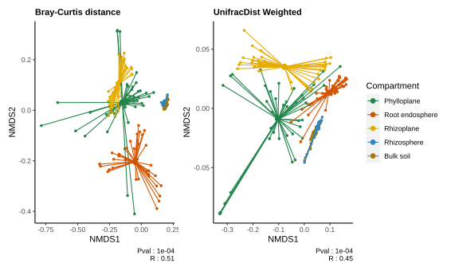

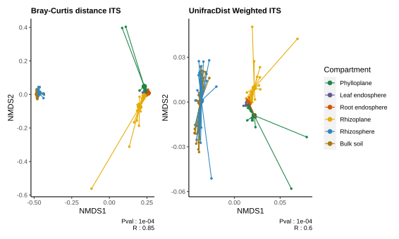

::: {style="display: flex; justify-content: space-between;"}
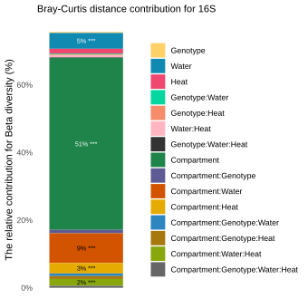

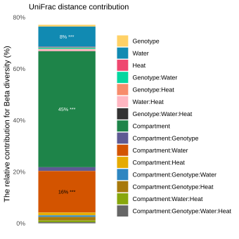
:::

::: {style="display: flex; justify-content: space-between;"}
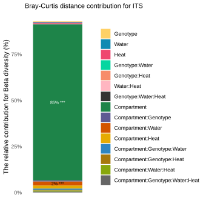

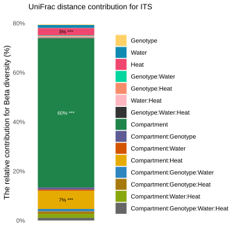
:::

```{r, pvalCompareGroupCompartment16S,eval=F}
# For 16S
# /!\ take time ~10 min for the creation of the two pval plot

# Parameter ----
set.seed(1)
permutation_i=100000 #for more accuracy
combinations<-expand.grid(
  compartment_l=apply(combn(levels(as.factor(df_16S_metadata$compartment_l)), 2, simplify = TRUE), 2, function(x) paste(x, collapse = ".")) # Generate all possible combinations without duplications
  ) %>% 
  tidyr::separate(compartment_l, into = c("compartment_l1", "compartment_l2"), sep = "\\.") %>% 
  mutate(min_n_seqs=16000)

# For Bray-Curtis ----
source(here::here("src/diff_grp_beta_div/pval_bray_curt_dist_compartment.R")) # is multiprocessing but take time
# For UniFrac ----
source(here::here("src/diff_grp_beta_div/pval_unifrac_dist_compartment.R")) # is loop so take a lot of time

#creation of the heatmap
heatmap_colors <- colorRampPalette(c("white","#0E4C92"))(100)
format_pvalues <- function(pvalue) {
  if (pvalue < 0.0001) {
    return("<0.0001")
  }else if(pvalue > 0.05){
    return(NA)
  }else {
    return(sprintf("%.4f", pvalue))
  }
}

matrice_pvalues<-cbind(matrice_pvalues_bc,matrice_pvalues_unifrac) ; colnames(matrice_pvalues)=c("Bray-Curtis","UniFrac") %>% t()
transformed_pvalues<-cbind(transformed_pvalues_bc,transformed_pvalues_unifrac) ; colnames(transformed_pvalues)=c("Bray-Curtis","UniFrac") %>% t()

svg(here::here("report/mcom/plot/Bdiv_diff_pval_compartment.svg"),    # create PNG for the heat map        
    width = 5,        # 5 x 300 pixels
    height = 9,
    pointsize = 10)        # smaller font size


# Afficher la heatmap
heatmap.2(transformed_pvalues %>% t() %>% t(), 
          trace = "none", 
          main = "",
          col = heatmap_colors,  
          cellnote =  matrix(apply(matrice_pvalues %>% t() %>% t(), c(1, 2), format_pvalues), nrow = nrow(matrice_pvalues %>% t() %>% t())),
          notecol = "white",  
          margins = c(17, 16),
          key.title ="-log10(p-values)",
          Colv=FALSE
)

dev.off() 
```

```{r, pvalCompareGroupCompartmentITS,eval=F}
# For ITS
# /!\ take time ~10 min for the creation of the two pval plot

# Parameter ----
set.seed(1)
permutation_i=100000 #for more accuracy
combinations<-expand.grid(
  compartment_l=apply(combn(levels(as.factor(df_ITS_metadata$compartment_l)), 2, simplify = TRUE), 2, function(x) paste(x, collapse = ".")) # Generate all possible combinations without duplications
  ) %>% 
  tidyr::separate(compartment_l, into = c("compartment_l1", "compartment_l2"), sep = "\\.") %>% 
  mutate(min_n_seqs=80000)

# For Bray-Curtis ----
source(here::here("src/diff_grp_beta_div/pval_bray_curt_dist_compartment_ITS.R")) # is multiprocessing but take time
# For UniFrac ----
source(here::here("src/diff_grp_beta_div/pval_unifrac_dist_compartment_ITS.R")) # is loop so take a lot of time

#creation of the heatmap
heatmap_colors <- colorRampPalette(c("white","#0E4C92"))(100)
format_pvalues <- function(pvalue) {
  if (pvalue < 0.0001) {
    return("<0.0001")
  }else if(pvalue > 0.05){
    return(NA)
  }else {
    return(sprintf("%.4f", pvalue))
  }
}

matrice_pvalues<-cbind(matrice_pvalues_bc,matrice_pvalues_unifrac) ; colnames(matrice_pvalues)=c("Bray-Curtis","UniFrac") %>% t()
transformed_pvalues<-cbind(transformed_pvalues_bc,transformed_pvalues_unifrac) ; colnames(transformed_pvalues)=c("Bray-Curtis","UniFrac") %>% t()

svg(here::here("report/mcom/plot/Bdiv_diff_pval_compartment_ITS.svg"),    # create PNG for the heat map        
    width = 5,        # 5 x 300 pixels
    height = 9,
    pointsize = 10)        # smaller font size


# Afficher la heatmap
heatmap.2(transformed_pvalues %>% t() %>% t(), 
          trace = "none", 
          main = "",
          col = heatmap_colors,  
          cellnote =  matrix(apply(matrice_pvalues %>% t() %>% t(), c(1, 2), format_pvalues), nrow = nrow(matrice_pvalues %>% t() %>% t())),
          notecol = "white",  
          margins = c(17, 16),
          key.title ="-log10(p-values)",
          Colv=FALSE
)

dev.off() 
```

::: {style="display: flex; justify-content: space-between;"}


:::

### Beta-diversity by compartment and climat condition

```{r, BdivBrayCurtisClimatCond,eval=F}
# /!\ take time
source(here::here("src/function/Bdiv_NMDS_climat_cond.R")) 

# For 16S
#methode_i = "Bray-Curtis" , "Jaccard"

Plot_B_curt_climat_lo=Bdiv_NMDS_climat_cond(compartment_i = "Phylloplane",min_sample = 16000, methode_i = "Bray-Curtis")
#Plot_B_curt_climat_li=Bdiv_NMDS_climat_cond(compartment_i = "Leaf endosphere",min_sample=1800, methode_i = "Bray-Curtis")
Plot_B_curt_climat_ri=Bdiv_NMDS_climat_cond(compartment_i = "Root endosphere",min_sample = 16000, methode_i = "Bray-Curtis")
Plot_B_curt_climat_ro=Bdiv_NMDS_climat_cond(compartment_i = "Rhizoplane",min_sample = 16000, methode_i = "Bray-Curtis")
Plot_B_curt_climat_rh=Bdiv_NMDS_climat_cond(compartment_i = "Rhizosphere",min_sample = 16000, methode_i = "Bray-Curtis")
Plot_B_curt_climat_bk=Bdiv_NMDS_climat_cond(compartment_i = "Bulk soil",min_sample = 16000, methode_i = "Bray-Curtis")

Plot_Jaccard_climat_lo=Bdiv_NMDS_climat_cond(compartment_i = "Phylloplane",min_sample = 16000, methode_i = "Jaccard")
#Plot_Jaccard_climat_li=Bdiv_NMDS_climat_cond(compartment_i = "Leaf endosphere",min_sample=1800, methode_i = "Jaccard")
Plot_Jaccard_climat_ri=Bdiv_NMDS_climat_cond(compartment_i = "Root endosphere",min_sample = 16000, methode_i = "Jaccard")
Plot_Jaccard_climat_ro=Bdiv_NMDS_climat_cond(compartment_i = "Rhizoplane",min_sample = 16000, methode_i = "Jaccard")
Plot_Jaccard_climat_rh=Bdiv_NMDS_climat_cond(compartment_i = "Rhizosphere",min_sample = 16000, methode_i = "Jaccard")
Plot_Jaccard_climat_bk=Bdiv_NMDS_climat_cond(compartment_i = "Bulk soil",min_sample = 16000, methode_i = "Jaccard")

# "UniFrac Weighted"
Plot_UniFrac_climat_lo=Bdiv_NMDS_Unifrac_climat_cond(sub_phylo=subset_samples(phyloseq_16S_filt_rar_16000, compartment_l == "Phylloplane"), compartment_i = "Phylloplane", methode_i = "UniFrac Weighted")
#Plot_UniFrac_climat_li=Bdiv_NMDS_Unifrac_climat_cond(sub_phylo=subset_samples(phyloseq_16S_filt_rar_1800, compartment_l == "Leaf endosphere"), compartment_i = "Leaf endosphere",methode_i = "UniFrac Weighted")
Plot_UniFrac_climat_ri=Bdiv_NMDS_Unifrac_climat_cond(sub_phylo=subset_samples(phyloseq_16S_filt_rar_16000, compartment_l == "Root endosphere"), compartment_i = "Root endosphere",methode_i = "UniFrac Weighted")
Plot_UniFrac_climat_ro=Bdiv_NMDS_Unifrac_climat_cond(sub_phylo=subset_samples(phyloseq_16S_filt_rar_16000, compartment_l == "Rhizoplane"), compartment_i = "Rhizoplane",methode_i = "UniFrac Weighted")
Plot_UniFrac_climat_rh=Bdiv_NMDS_Unifrac_climat_cond(sub_phylo=subset_samples(phyloseq_16S_filt_rar_16000, compartment_l == "Rhizosphere"), compartment_i = "Rhizosphere", methode_i = "UniFrac Weighted")
Plot_UniFrac_climat_bk=Bdiv_NMDS_Unifrac_climat_cond(sub_phylo=subset_samples(phyloseq_16S_filt_rar_16000, compartment_l == "Bulk soil"), compartment_i = "Bulk soil", methode_i = "UniFrac Weighted")

Plot_resum_B_all_climat=
  Plot_B_curt_climat_lo+
  Plot_Jaccard_climat_lo+
  Plot_UniFrac_climat_lo+
  # Plot_B_curt_climat_li+
  # Plot_Jaccard_climat_li+
  # Plot_UniFrac_climat_li+
  Plot_B_curt_climat_ri+
  Plot_Jaccard_climat_ri+
  Plot_UniFrac_climat_ri+
  Plot_B_curt_climat_ro+
  Plot_Jaccard_climat_ro+
  Plot_UniFrac_climat_ro+
  Plot_B_curt_climat_rh+
  Plot_Jaccard_climat_rh+
  Plot_UniFrac_climat_rh+
  Plot_B_curt_climat_bk+
  Plot_Jaccard_climat_bk+
  Plot_UniFrac_climat_bk+
plot_layout(ncol = 3,guides = 'collect')

Plot_Bdiv_NMSD_Bray_curtis_climat_cond=
  Plot_B_curt_climat_lo+
  #Plot_B_curt_climat_li+
  Plot_B_curt_climat_ri+
  Plot_B_curt_climat_ro+
  Plot_B_curt_climat_rh+
  Plot_B_curt_climat_bk+
  guide_area() + 
plot_layout(ncol = 2,guides = 'collect')

ggsave(here::here("report/mcom/plot/Bdiv_NMSD_all_climat_cond.svg"), Plot_resum_B_all_climat,width = 30,height = 40, units = "cm")
ggsave(here::here("report/mcom/plot/Bdiv_NMSD_Bray_curtis_climat_cond.svg"), Plot_Bdiv_NMSD_Bray_curtis_climat_cond,width = 20,height = 25, units = "cm")


# For ITS
#methode_i = "Bray-Curtis" , "Jaccard"

Plot_B_curt_climat_lo=Bdiv_NMDS_climat_cond(compartment_i = "Phylloplane",min_sample = 80000, methode_i = "Bray-Curtis", type = "ITS", data_x = df_ITS_count_filt)
Plot_B_curt_climat_li=Bdiv_NMDS_climat_cond(compartment_i = "Leaf endosphere",min_sample=8000, methode_i = "Bray-Curtis", type = "ITS", data_x = df_ITS_count_filt)
Plot_B_curt_climat_ri=Bdiv_NMDS_climat_cond(compartment_i = "Root endosphere",min_sample = 80000, methode_i = "Bray-Curtis", type = "ITS", data_x = df_ITS_count_filt)
Plot_B_curt_climat_ro=Bdiv_NMDS_climat_cond(compartment_i = "Rhizoplane",min_sample = 80000, methode_i = "Bray-Curtis", type = "ITS", data_x = df_ITS_count_filt)
Plot_B_curt_climat_rh=Bdiv_NMDS_climat_cond(compartment_i = "Rhizosphere",min_sample = 80000, methode_i = "Bray-Curtis", type = "ITS", data_x = df_ITS_count_filt)
Plot_B_curt_climat_bk=Bdiv_NMDS_climat_cond(compartment_i = "Bulk soil",min_sample = 80000, methode_i = "Bray-Curtis", type = "ITS", data_x = df_ITS_count_filt)

Plot_Jaccard_climat_lo=Bdiv_NMDS_climat_cond(compartment_i = "Phylloplane",min_sample = 80000, methode_i = "Jaccard", type = "ITS", data_x = df_ITS_count_filt)
Plot_Jaccard_climat_li=Bdiv_NMDS_climat_cond(compartment_i = "Leaf endosphere",min_sample=8000, methode_i = "Jaccard", type = "ITS", data_x = df_ITS_count_filt)
Plot_Jaccard_climat_ri=Bdiv_NMDS_climat_cond(compartment_i = "Root endosphere",min_sample = 80000, methode_i = "Jaccard", type = "ITS", data_x = df_ITS_count_filt)
Plot_Jaccard_climat_ro=Bdiv_NMDS_climat_cond(compartment_i = "Rhizoplane",min_sample = 80000, methode_i = "Jaccard", type = "ITS", data_x = df_ITS_count_filt)
Plot_Jaccard_climat_rh=Bdiv_NMDS_climat_cond(compartment_i = "Rhizosphere",min_sample = 80000, methode_i = "Jaccard", type = "ITS", data_x = df_ITS_count_filt)
Plot_Jaccard_climat_bk=Bdiv_NMDS_climat_cond(compartment_i = "Bulk soil",min_sample = 80000, methode_i = "Jaccard", type = "ITS", data_x = df_ITS_count_filt)

# "UniFrac Weighted"
Plot_UniFrac_climat_lo=Bdiv_NMDS_Unifrac_climat_cond(sub_phylo=subset_samples(phyloseq_ITS_filt_rar_80000, compartment_l == "Phylloplane"), compartment_i = "Phylloplane", methode_i = "UniFrac Weighted", type = "ITS")
Plot_UniFrac_climat_li=Bdiv_NMDS_Unifrac_climat_cond(sub_phylo=subset_samples(phyloseq_ITS_filt_rar_80000, compartment_l == "Leaf endosphere"), compartment_i = "Leaf endosphere",methode_i = "UniFrac Weighted", type = "ITS")
Plot_UniFrac_climat_ri=Bdiv_NMDS_Unifrac_climat_cond(sub_phylo=subset_samples(phyloseq_ITS_filt_rar_80000, compartment_l == "Root endosphere"), compartment_i = "Root endosphere",methode_i = "UniFrac Weighted", type = "ITS")
Plot_UniFrac_climat_ro=Bdiv_NMDS_Unifrac_climat_cond(sub_phylo=subset_samples(phyloseq_ITS_filt_rar_80000, compartment_l == "Rhizoplane"), compartment_i = "Rhizoplane",methode_i = "UniFrac Weighted", type = "ITS")
Plot_UniFrac_climat_rh=Bdiv_NMDS_Unifrac_climat_cond(sub_phylo=subset_samples(phyloseq_ITS_filt_rar_80000, compartment_l == "Rhizosphere"), compartment_i = "Rhizosphere", methode_i = "UniFrac Weighted", type = "ITS")
Plot_UniFrac_climat_bk=Bdiv_NMDS_Unifrac_climat_cond(sub_phylo=subset_samples(phyloseq_ITS_filt_rar_80000, compartment_l == "Bulk soil"), compartment_i = "Bulk soil", methode_i = "UniFrac Weighted", type = "ITS")

Plot_resum_B_all_climat=
  Plot_B_curt_climat_lo+
  Plot_Jaccard_climat_lo+
  Plot_UniFrac_climat_lo+
  Plot_B_curt_climat_li+
  Plot_Jaccard_climat_li+
  Plot_UniFrac_climat_li+
  Plot_B_curt_climat_ri+
  Plot_Jaccard_climat_ri+
  Plot_UniFrac_climat_ri+
  Plot_B_curt_climat_ro+
  Plot_Jaccard_climat_ro+
  Plot_UniFrac_climat_ro+
  Plot_B_curt_climat_rh+
  Plot_Jaccard_climat_rh+
  Plot_UniFrac_climat_rh+
  Plot_B_curt_climat_bk+
  Plot_Jaccard_climat_bk+
  Plot_UniFrac_climat_bk+
plot_layout(ncol = 3,guides = 'collect')

Plot_Bdiv_NMSD_Bray_curtis_climat_cond=
  Plot_B_curt_climat_lo+
  Plot_B_curt_climat_li+
  Plot_B_curt_climat_ri+
  Plot_B_curt_climat_ro+
  Plot_B_curt_climat_rh+
  Plot_B_curt_climat_bk+
  guide_area() + 
plot_layout(ncol = 2,guides = 'collect')

ggsave(here::here("report/mcom/plot/Bdiv_NMSD_all_climat_cond_ITS.svg"), Plot_resum_B_all_climat,width = 30,height = 40, units = "cm")
ggsave(here::here("report/mcom/plot/Bdiv_NMSD_Bray_curtis_climat_cond_ITS.svg"), Plot_Bdiv_NMSD_Bray_curtis_climat_cond,width = 20,height = 25, units = "cm")
```

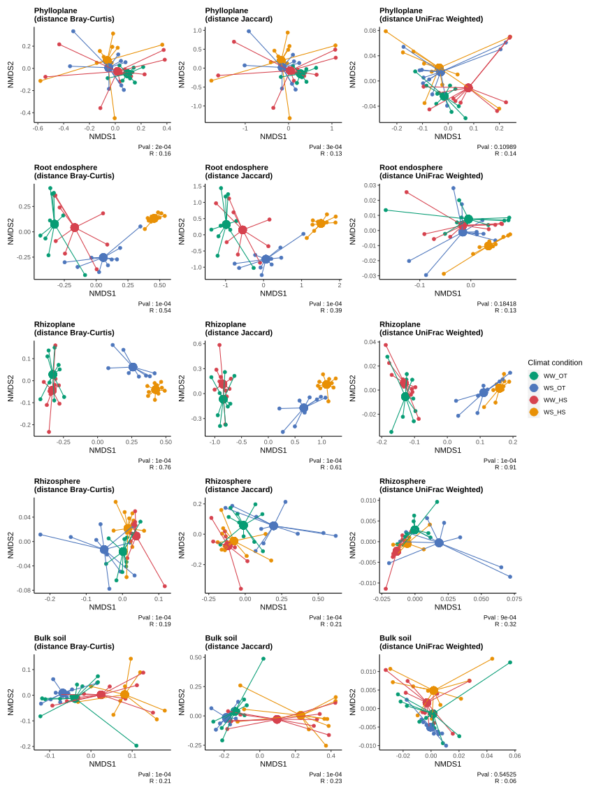

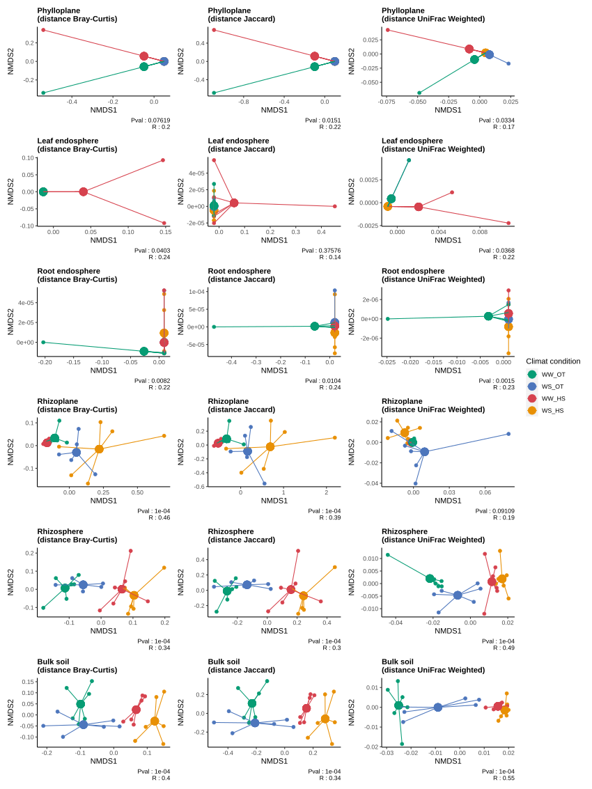

### PERMANOVA resum

To test whether the groups are different with respect to centroid and dispersion, a PERMANOVA statistical test will be performed. For this a multivariate extension of ANOVA will be used, as there are many ASV that will be used in the test. The extension is based on distances between samples. The test compares distances of samples within the same group to distances of samples from different groups. If the distance between samples from the different groups is much larger than samples from the same group, we conclude that the groups are not equal.\
In order to test the significance of the result, a permutation test is used. Thus all samples are randomly mixed over the groups and the test is repeated many times. If the ratio (between group distance / within group distance) is much larger for the original data than for the permutations, we conclude there is a statistical significant difference. The test can be applied in combination with any distance measure. Here we use the Bray-Curtis and UniFrac distance (was also used for the NMDS above).

```{r,RelativeContributionByCompartment16S, eval=FALSE}
# For 16S
# /!\ take time ~5 min for the creation of the data frame 
permutation_i=10000 # more accurate more this number is high (but also realy more slow)
set.seed(1)
# df_param=data.frame(compartment_l_input=levels(df_16S_metadata$compartment_l),
#                     min_n_seqs=c(14000,1800,14000,14000,14000,14000))

df_param=data.frame(compartment_l_input=levels(df_16S_metadata$compartment_l),
                    min_n_seqs=c(16000,16000,16000,16000,16000))


  # For Bray-Curtis ----
  method="Bray-Curtis"
  compile_result=as.data.frame(matrix(data=NA,nrow = 0, ncol = 6))
  
  for (i in 1:nrow(df_param)){
    cat("method: ",method,
        " ; compartment:" ,df_param$compartment_l_input[i], 
        " ; min_n_seqs : ",df_param$min_n_seqs[i],
        "\n")
    
    df_x= df_16S_count_filt  %>% 
      t() %>% 
      as.data.frame() %>% 
      rownames_to_column("sample_name") %>% 
      inner_join(.,df_16S_metadata %>% dplyr::select(sample_name,compartment_l),by="sample_name") %>% 
      filter(compartment_l==df_param$compartment_l_input[i]) %>% 
      dplyr::group_by(sample_name) %>% 
      dplyr::select(-compartment_l) %>% 
      column_to_rownames("sample_name") %>% 
      mutate(total=rowSums(.)) %>% 
      filter(total>df_param$min_n_seqs[i]) %>% 
      dplyr::select(-total) %>%     
      ungroup()
    
    dist_metric_compartment<- df_x %>% 
      vegan::avgdist(sample=df_param$min_n_seqs[i],iterations = 100) %>% 
      as.matrix() %>% 
      as.data.frame(optional = TRUE) %>% #add rowname from matrix
      rownames_to_column("sample_name") %>% 
      inner_join(.,df_16S_metadata %>% dplyr::select(sample_name,genotype, water_condition,heat_condition),by="sample_name")
  
  result_adonis_anova.cca_compartment<-adonis2(as.dist(dist_metric_compartment %>% 
                                                         dplyr::select(-c(sample_name,genotype, water_condition,heat_condition)))~
                                                 genotype*
                                                 water_condition*
                                                 heat_condition,
                                               data=dist_metric_compartment,
                                               permutations = permutation_i) %>% 
    as.data.frame() %>% 
    drop_na()
  
  row_name<-rownames(result_adonis_anova.cca_compartment)
  row_name <- gsub("genotype","Genotype",row_name)
  row_name <- gsub("water_condition","Water",row_name)
  row_name <- gsub("heat_condition","Heat",row_name)
  rownames(result_adonis_anova.cca_compartment)<-row_name
  
  result_adonis_anova.cca_compartment$compartment_l=as.character(df_param$compartment_l_input[i])
  compile_result=rbind(compile_result,result_adonis_anova.cca_compartment)
  }
  
  compile_result=compile_result %>% 
    drop_na() %>% 
        as.data.frame() %>% 
        rownames_to_column("contribution_variable") %>% 
        mutate(Significance = case_when(
          `Pr(>F)` <= 0.001 ~ '***',
          `Pr(>F)` < 0.01  ~ '**',
          `Pr(>F)` < 0.05  ~ '*',
          `Pr(>F)` < 0.1   ~ '.',
          TRUE            ~ ' '
        ))
  
  vec_compartment_l_i=df_param$compartment_l_input
  
  compile_result=compile_result%>% 
    filter(str_detect(contribution_variable, "Total", negate = TRUE)) %>% 
    filter(str_detect(contribution_variable, "Residual", negate = TRUE)) %>% 
    mutate_at(vars(contribution_variable), ~str_replace_all(., "\\$", ""))%>%
    mutate_at(vars(contribution_variable), ~str_replace_all(., "[0-9]", "")) %>% 
    mutate(contribution_variable = as.character(contribution_variable)) %>% 
    mutate(fontcolor = ifelse(contribution_variable %in% c("Water", "Genotype:Water:Heat"), "#ffffff", "#000000")) %>% 
    mutate(compartment_l=fct_relevel(compartment_l,vec_compartment_l_i)) %>% 
    mutate(contribution_variable=fct_relevel(contribution_variable,c("Genotype","Water","Heat", "Genotype:Water","Genotype:Heat","Water:Heat","Genotype:Water:Heat"))) %>% 
    mutate(text_output=paste0(round(R2*100,0), "% ", Significance))
  
  plot_contrib<-ggplot(compile_result, aes(x = compartment_l, y = R2, fill = contribution_variable)) +
    geom_bar(stat = "identity") +
    geom_text(aes(label = ifelse(R2 > 0.02, text_output, "")), color = compile_result$fontcolor, position = position_stack(vjust = 0.5), size = 2.5)+
    scale_fill_manual(values = c("#ffd166", #geno
                                 "#118ab2", #water
                                 "#ef476f",#heat
                                 "#06d6a0", #watergeno
                                 "#f78c6b", #genoheat
                                 "#FFB6C1", # waterheat
                                 "#333333"),
                      name = "title of legend (contribution") +#all
    scale_y_continuous(labels = scales::percent_format())+
    scale_color_identity()+
    labs(x = "Compartment",
         y = "The relative contribution for Beta diversity (%)",
         caption = paste0("(",method," Distance)")) +
    theme_minimal()+
    theme(panel.grid = element_blank(),
          legend.title = element_blank(), #for delete title
          axis.text.x = element_text(angle = 45,hjust = 1, vjust = 1),
          axis.title.x = element_blank()
    )
  
write.csv(file =  here::here(paste0("data/mcom/output/result_",method,"_anova.csv")),x = compile_result %>% dplyr::select(compartment_l,contribution_variable,R2, F, Df,`Pr(>F)`))

ggsave(here::here(paste0("report/mcom/plot/Bdiv_",method,"_contribution.svg")), plot_contrib,width = 12,height = 12, units = "cm")

# For UniFrac ----
method="UniFrac"
compile_result=as.data.frame(matrix(data=NA,nrow = 0, ncol = 6))

for (i in 1:nrow(df_param)){
  cat(df_param$compartment_l_input[i])
  
  if(df_param$min_n_seqs[i]==16000){
    cat(" ; min n seq: 16000 \n")
    compartment_value=df_param$compartment_l_input[i]
    df_x= subset_samples(phyloseq_16S_filt_rar_16000, compartment_l == compartment_value)
  }else{
    cat("min n seq: 1800 \n")
    df_x= subset_samples(phyloseq_16S_filt_rar_1800, compartment_l == df_param$compartment_l_input[i]) 
  }
  
  dist_metric_compartment <-as.data.frame(as.matrix(phyloseq::distance(df_x,method = "unifrac", weighted = T))) %>% 
    as.matrix() %>% 
    as.data.frame(logical=T) %>% 
    rownames_to_column("sample_name") %>% 
    inner_join(.,df_16S_metadata %>% dplyr::select(sample_name,genotype, water_condition,heat_condition),by="sample_name")
  
  result_adonis_anova.cca_compartment<-adonis2(as.dist(dist_metric_compartment %>% 
                                                         dplyr::select(-c(sample_name,genotype, water_condition,heat_condition)))~
                                                 genotype*
                                                 water_condition*
                                                 heat_condition,
                                               data=dist_metric_compartment,
                                               permutations = permutation_i) %>% 
    as.data.frame() %>% 
    drop_na()
  
  row_name<-rownames(result_adonis_anova.cca_compartment)
  #row_name <- gsub("df_16S_metadata\\$","",row_name)
  row_name <- gsub("genotype","Genotype",row_name)
  row_name <- gsub("water_condition","Water",row_name)
  row_name <- gsub("heat_condition","Heat",row_name)
  rownames(result_adonis_anova.cca_compartment)<-row_name
  
  result_adonis_anova.cca_compartment$compartment_l=as.character(df_param$compartment_l_input[i])
  compile_result=rbind(compile_result,result_adonis_anova.cca_compartment)
}

compile_result=compile_result %>% 
  drop_na() %>% 
      as.data.frame() %>% 
      rownames_to_column("contribution_variable") %>% 
      mutate(Significance = case_when(
        `Pr(>F)` <= 0.001 ~ '***',
        `Pr(>F)` < 0.01  ~ '**',
        `Pr(>F)` < 0.05  ~ '*',
        `Pr(>F)` < 0.1   ~ '.',
        TRUE            ~ ' '
      ))

vec_compartment_l_i=df_param$compartment_l_input

compile_result=compile_result%>% 
  filter(str_detect(contribution_variable, "Total", negate = TRUE)) %>% 
  filter(str_detect(contribution_variable, "Residual", negate = TRUE)) %>% 
  mutate_at(vars(contribution_variable), ~str_replace_all(., "\\$", ""))%>%
  mutate_at(vars(contribution_variable), ~str_replace_all(., "[0-9]", "")) %>% 
  mutate(contribution_variable = as.character(contribution_variable)) %>% 
  mutate(fontcolor = ifelse(contribution_variable %in% c("Water", "Genotype:Water:Heat"), "#ffffff", "#000000")) %>% 
  mutate(compartment_l=fct_relevel(compartment_l,vec_compartment_l_i)) %>% 
  mutate(contribution_variable=fct_relevel(contribution_variable,c("Genotype","Water","Heat", "Genotype:Water","Genotype:Heat","Water:Heat","Genotype:Water:Heat"))) %>% 
  mutate(text_output=paste0(round(R2*100,0), "% ", Significance))

plot_contrib<-ggplot(compile_result, aes(x = compartment_l, y = R2, fill = contribution_variable)) +
  geom_bar(stat = "identity") +
  geom_text(aes(label = ifelse(R2 > 0.02, text_output, "")), color = compile_result$fontcolor, position = position_stack(vjust = 0.5), size = 2.5)+
  scale_fill_manual(values = c("#ffd166", #geno
                               "#118ab2", #water
                               "#ef476f",#heat
                               "#06d6a0", #watergeno
                               "#f78c6b", #genoheat
                               "#FFB6C1", # waterheat
                               "#333333"),
                    name = "title of legend (contribution") +#all
  scale_y_continuous(labels = scales::percent_format())+
  scale_color_identity()+
  labs(x = "Compartment",
       y = "The relative contribution for Beta diversity (%)",
       caption = paste0("(",method," Distance)")) +
  theme_minimal()+
  theme(panel.grid = element_blank(),
        legend.title = element_blank(), #for delete title
        axis.text.x = element_text(angle = 45,hjust = 1, vjust = 1),
        axis.title.x = element_blank()
  )

write.csv(file =  here::here(paste0("data/mcom/output/result_",method,"_anova.csv")),x = compile_result %>% dplyr::select(compartment_l,contribution_variable,R2, F, Df,`Pr(>F)`))
ggsave(here::here(paste0("report/mcom/plot/Bdiv_",method,"_contribution.svg")), plot_contrib,width = 12,height = 12, units = "cm")
```


```{r,RelativeContributionByCompartmentITS, eval=FALSE}
# For ITS
# /!\ take time ~5 min for the creation of the data frame 
permutation_i=10000 # more accurate more this number is high (but also realy more slow)
set.seed(1)
# df_param=data.frame(compartment_l_input=levels(df_16S_metadata$compartment_l),
#                     min_n_seqs=c(14000,1800,14000,14000,14000,14000))

df_param=data.frame(compartment_l_input=levels(df_ITS_metadata$compartment_l),
                    min_n_seqs=c(80000,80000,80000,80000,80000,80000))


  # For Bray-Curtis ----
  method="Bray-Curtis"
  compile_result=as.data.frame(matrix(data=NA,nrow = 0, ncol = 6))
  
  for (i in 1:nrow(df_param)){
    cat("method: ",method,
        " ; compartment:" ,df_param$compartment_l_input[i], 
        " ; min_n_seqs : ",df_param$min_n_seqs[i],
        "\n")
    
    df_x= df_ITS_count_filt  %>% 
      t() %>% 
      as.data.frame() %>% 
      rownames_to_column("sample_name") %>% 
      inner_join(.,df_ITS_metadata %>% dplyr::select(sample_name,compartment_l),by="sample_name") %>% 
      filter(compartment_l==df_param$compartment_l_input[i]) %>% 
      dplyr::group_by(sample_name) %>% 
      dplyr::select(-compartment_l) %>% 
      column_to_rownames("sample_name") %>% 
      mutate(total=rowSums(.)) %>% 
      filter(total>df_param$min_n_seqs[i]) %>% 
      dplyr::select(-total) %>%     
      ungroup()
    
    dist_metric_compartment<- df_x %>% 
      vegan::avgdist(sample=df_param$min_n_seqs[i],iterations = 100) %>% 
      as.matrix() %>% 
      as.data.frame(optional = TRUE) %>% #add rowname from matrix
      rownames_to_column("sample_name") %>% 
      inner_join(.,df_ITS_metadata %>% dplyr::select(sample_name,genotype, water_condition,heat_condition),by="sample_name")
  
  result_adonis_anova.cca_compartment<-adonis2(as.dist(dist_metric_compartment %>% 
                                                         dplyr::select(-c(sample_name,genotype, water_condition,heat_condition)))~
                                                 genotype*
                                                 water_condition*
                                                 heat_condition,
                                               data=dist_metric_compartment,
                                               permutations = permutation_i) %>% 
    as.data.frame() %>% 
    drop_na()
  
  row_name<-rownames(result_adonis_anova.cca_compartment)
  row_name <- gsub("genotype","Genotype",row_name)
  row_name <- gsub("water_condition","Water",row_name)
  row_name <- gsub("heat_condition","Heat",row_name)
  rownames(result_adonis_anova.cca_compartment)<-row_name
  
  result_adonis_anova.cca_compartment$compartment_l=as.character(df_param$compartment_l_input[i])
  compile_result=rbind(compile_result,result_adonis_anova.cca_compartment)
  }
  
  compile_result=compile_result %>% 
    drop_na() %>% 
        as.data.frame() %>% 
        rownames_to_column("contribution_variable") %>% 
        mutate(Significance = case_when(
          `Pr(>F)` <= 0.001 ~ '***',
          `Pr(>F)` < 0.01  ~ '**',
          `Pr(>F)` < 0.05  ~ '*',
          `Pr(>F)` < 0.1   ~ '.',
          TRUE            ~ ' '
        ))
  
  vec_compartment_l_i=df_param$compartment_l_input
  
  compile_result=compile_result%>% 
    filter(str_detect(contribution_variable, "Total", negate = TRUE)) %>% 
    filter(str_detect(contribution_variable, "Residual", negate = TRUE)) %>% 
    mutate_at(vars(contribution_variable), ~str_replace_all(., "\\$", ""))%>%
    mutate_at(vars(contribution_variable), ~str_replace_all(., "[0-9]", "")) %>% 
    mutate(contribution_variable = as.character(contribution_variable)) %>% 
    mutate(fontcolor = ifelse(contribution_variable %in% c("Water", "Genotype:Water:Heat"), "#ffffff", "#000000")) %>% 
    mutate(compartment_l=fct_relevel(compartment_l,vec_compartment_l_i)) %>% 
    mutate(contribution_variable=fct_relevel(contribution_variable,c("Genotype","Water","Heat", "Genotype:Water","Genotype:Heat","Water:Heat","Genotype:Water:Heat"))) %>% 
    mutate(text_output=paste0(round(R2*100,0), "% ", Significance))
  
  plot_contrib<-ggplot(compile_result, aes(x = compartment_l, y = R2, fill = contribution_variable)) +
    geom_bar(stat = "identity") +
    geom_text(aes(label = ifelse(R2 > 0.02, text_output, "")), color = compile_result$fontcolor, position = position_stack(vjust = 0.5), size = 2.5)+
    scale_fill_manual(values = c("#ffd166", #geno
                                 "#118ab2", #water
                                 "#ef476f",#heat
                                 "#06d6a0", #watergeno
                                 "#f78c6b", #genoheat
                                 "#FFB6C1", # waterheat
                                 "#333333"),
                      name = "title of legend (contribution") +#all
    scale_y_continuous(labels = scales::percent_format())+
    scale_color_identity()+
    labs(x = "Compartment",
         y = "The relative contribution for Beta diversity (%)",
         caption = paste0("(",method," Distance)"),
         subtitle = "ITS") +
    theme_minimal()+
    theme(panel.grid = element_blank(),
          legend.title = element_blank(), #for delete title
          axis.text.x = element_text(angle = 45,hjust = 1, vjust = 1),
          axis.title.x = element_blank()
    )
  
write.csv(file =  here::here(paste0("data/mcom/output/result_",method,"_anova_ITS.csv")),x = compile_result %>% dplyr::select(compartment_l,contribution_variable,R2, F, Df,`Pr(>F)`))

ggsave(here::here(paste0("report/mcom/plot/Bdiv_",method,"_contribution_ITS.svg")), plot_contrib,width = 12,height = 12, units = "cm")

# For UniFrac ----
method="UniFrac"
compile_result=as.data.frame(matrix(data=NA,nrow = 0, ncol = 6))

for (i in 1:nrow(df_param)){
  cat(df_param$compartment_l_input[i])
  
  if(df_param$min_n_seqs[i]==80000){
    cat(" ; min n seq: 80000 \n")
    compartment_value=df_param$compartment_l_input[i]
    df_x= subset_samples(phyloseq_ITS_filt_rar_80000, compartment_l == compartment_value)
  }else{
    cat("min n seq: 1800 error\n")
  }
  
  dist_metric_compartment <-as.data.frame(as.matrix(phyloseq::distance(df_x,method = "unifrac", weighted = T))) %>% 
    as.matrix() %>% 
    as.data.frame(logical=T) %>% 
    rownames_to_column("sample_name") %>% 
    inner_join(.,df_ITS_metadata %>% dplyr::select(sample_name,genotype, water_condition,heat_condition),by="sample_name")
  
  result_adonis_anova.cca_compartment<-adonis2(as.dist(dist_metric_compartment %>% 
                                                         dplyr::select(-c(sample_name,genotype, water_condition,heat_condition)))~
                                                 genotype*
                                                 water_condition*
                                                 heat_condition,
                                               data=dist_metric_compartment,
                                               permutations = permutation_i) %>% 
    as.data.frame() %>% 
    drop_na()
  
  row_name<-rownames(result_adonis_anova.cca_compartment)
  #row_name <- gsub("df_ITS_metadata\\$","",row_name)
  row_name <- gsub("genotype","Genotype",row_name)
  row_name <- gsub("water_condition","Water",row_name)
  row_name <- gsub("heat_condition","Heat",row_name)
  rownames(result_adonis_anova.cca_compartment)<-row_name
  
  result_adonis_anova.cca_compartment$compartment_l=as.character(df_param$compartment_l_input[i])
  compile_result=rbind(compile_result,result_adonis_anova.cca_compartment)
}

compile_result=compile_result %>% 
  drop_na() %>% 
      as.data.frame() %>% 
      rownames_to_column("contribution_variable") %>% 
      mutate(Significance = case_when(
        `Pr(>F)` <= 0.001 ~ '***',
        `Pr(>F)` < 0.01  ~ '**',
        `Pr(>F)` < 0.05  ~ '*',
        `Pr(>F)` < 0.1   ~ '.',
        TRUE            ~ ' '
      ))

vec_compartment_l_i=df_param$compartment_l_input

compile_result=compile_result%>% 
  filter(str_detect(contribution_variable, "Total", negate = TRUE)) %>% 
  filter(str_detect(contribution_variable, "Residual", negate = TRUE)) %>% 
  mutate_at(vars(contribution_variable), ~str_replace_all(., "\\$", ""))%>%
  mutate_at(vars(contribution_variable), ~str_replace_all(., "[0-9]", "")) %>% 
  mutate(contribution_variable = as.character(contribution_variable)) %>% 
  mutate(fontcolor = ifelse(contribution_variable %in% c("Water", "Genotype:Water:Heat"), "#ffffff", "#000000")) %>% 
  mutate(compartment_l=fct_relevel(compartment_l,vec_compartment_l_i)) %>% 
  mutate(contribution_variable=fct_relevel(contribution_variable,c("Genotype","Water","Heat", "Genotype:Water","Genotype:Heat","Water:Heat","Genotype:Water:Heat"))) %>% 
  mutate(text_output=paste0(round(R2*100,0), "% ", Significance))

plot_contrib<-ggplot(compile_result, aes(x = compartment_l, y = R2, fill = contribution_variable)) +
  geom_bar(stat = "identity") +
  geom_text(aes(label = ifelse(R2 > 0.02, text_output, "")), color = compile_result$fontcolor, position = position_stack(vjust = 0.5), size = 2.5)+
  scale_fill_manual(values = c("#ffd166", #geno
                               "#118ab2", #water
                               "#ef476f",#heat
                               "#06d6a0", #watergeno
                               "#f78c6b", #genoheat
                               "#FFB6C1", # waterheat
                               "#333333"),
                    name = "title of legend (contribution") +#all
  scale_y_continuous(labels = scales::percent_format())+
  scale_color_identity()+
  labs(x = "Compartment",
       y = "The relative contribution for Beta diversity (%)",
       caption = paste0("(",method," Distance)"),
       subtitle = "ITS") +
  theme_minimal()+
  theme(panel.grid = element_blank(),
        legend.title = element_blank(), #for delete title
        axis.text.x = element_text(angle = 45,hjust = 1, vjust = 1),
        axis.title.x = element_blank()
  )

write.csv(file =  here::here(paste0("data/mcom/output/result_",method,"_anova_ITS.csv")),x = compile_result %>% dplyr::select(compartment_l,contribution_variable,R2, F, Df,`Pr(>F)`))
ggsave(here::here(paste0("report/mcom/plot/Bdiv_",method,"_contribution_ITS.svg")), plot_contrib,width = 12,height = 12, units = "cm")
```

::: {style="display: flex; justify-content: space-between;"}
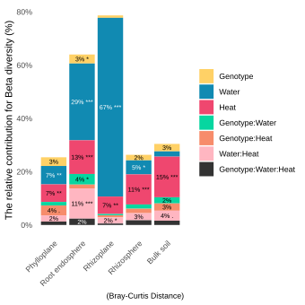

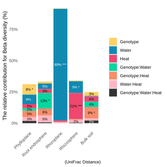
:::

::: {style="display: flex; justify-content: space-between;"}
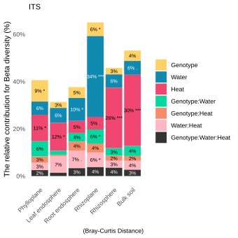

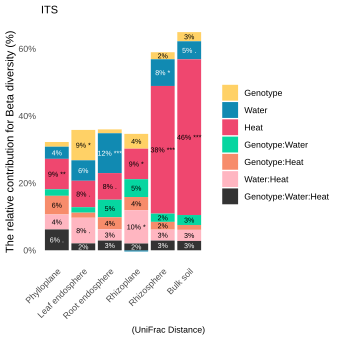
:::

To compare each group, I need to subset the data and perform statistical analyses using ADONIS to determine significance.

```{r, pvalCompareGroupClimatCond,eval=F}
# /!\ take time ~10 min for the creation of the two pval plot

# Parameter ----
set.seed(1)
permutation_i=1000000 #for more accuracy

# For 16S
combinations<-expand.grid(
  climat_condition=apply(combn(levels(as.factor(df_16S_metadata$climat_condition)), 2, simplify = TRUE), 2, function(x) paste(x, collapse = ".")), # Generate all possible combinations without duplications,
  compartment_l=levels(as.factor(df_16S_metadata$compartment_l))
  ) %>% 
  tidyr::separate(climat_condition, into = c("climat_condition1", "climat_condition2"), sep = "\\.") %>% 
  mutate(min_n_seqs=ifelse(compartment_l=="Leaf endosphere",1800,16000))

# For Bray-Curtis 16S ----
source(here::here("src/diff_grp_beta_div/pval_bray_curt_dist_climat_cond.R")) # is multiprocessing but take time

# For UniFrac 16S ----
source(here::here("src/diff_grp_beta_div/pval_unifrac_dist_climat_cond.R")) # is loop so take a lot of time


# For ITS
combinations<-expand.grid(
  climat_condition=apply(combn(levels(as.factor(df_ITS_metadata$climat_condition)), 2, simplify = TRUE), 2, function(x) paste(x, collapse = ".")), # Generate all possible combinations without duplications,
  compartment_l=levels(as.factor(df_ITS_metadata$compartment_l))
  ) %>% 
  tidyr::separate(climat_condition, into = c("climat_condition1", "climat_condition2"), sep = "\\.") %>% 
  mutate(min_n_seqs=80000)

# For Bray-Curtis ITS ----
source(here::here("src/diff_grp_beta_div/pval_bray_curt_dist_climat_cond_ITS.R")) # is multiprocessing but take time

# For UniFrac ITS ----
source(here::here("src/diff_grp_beta_div/pval_unifrac_dist_climat_cond_ITS.R")) # is loop so take a lot of time
```

::: {style="display: flex; justify-content: space-between;"}


:::

::: {style="display: flex; justify-content: space-between;"}


:::


## Difference between the two genotype for diversity?

In the present code, a statistical analysis was conducted to compare the two genotypes with respect to alpha and beta diversity. The results were graphically represented to facilitate visual comparisons between the genotypes.

```{r, GenDiffDiv, eval=F}
# Stats alpha div student genotype
source(here::here("src/diff_genotype.R"))
```
